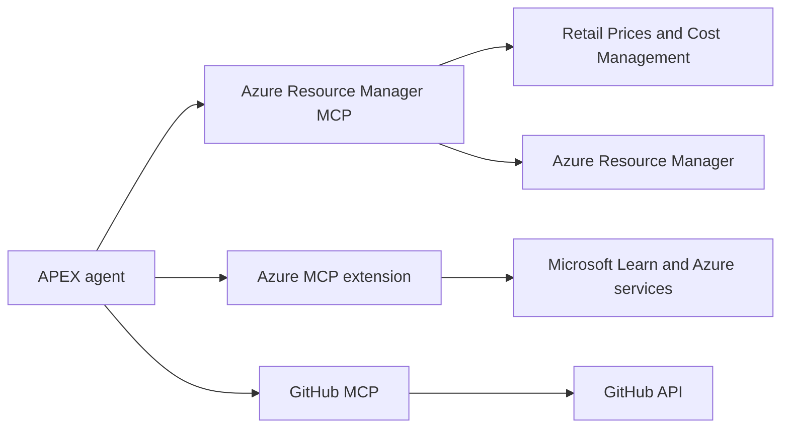

The Model Context Protocol (MCP) lets APEX agents discover and invoke external
tools through a consistent interface. Workspace servers are declared in
`.vscode/mcp.json`; the Azure MCP extension contributes additional tools from
VS Code.

## Architecture



Agents receive only the MCP tools declared in their frontmatter. Registering a
server does not grant every agent permission to every tool.

## Azure Resource Manager MCP

APEX uses Microsoft's hosted
[Azure Resource Manager MCP server](https://github.com/Azure/Azure-Resource-Manager-MCP)
for Azure retail pricing and cost management.

| Property | Value |
| --- | --- |
| Transport | HTTP |
| Endpoint | `https://mcp.management.azure.com` |
| Toolset | `CostManagement` |
| Authentication | Signed-in VS Code Azure identity |
| APEX scope | Read-only pricing and cost tools |

The workspace configuration is:

```json
{
  "servers": {
    "azure-resource-manager-mcp": {
      "type": "http",
      "url": "https://mcp.management.azure.com",
      "headers": {
        "x-mcp-toolset": "CostManagement"
      }
    }
  }
}
```

The server is currently a preview supported by GitHub Copilot Chat in VS Code
and GitHub Copilot CLI. Open [the installation link](https://aka.ms/JoinARMMCP)
when VS Code requires interactive registration, then sign in with the Azure
identity whose permissions should apply.

### Pricing and cost tools

The cost-estimate subagent uses an exact read-only allowlist:

| Tool | Use |
| --- | --- |
| `get_retail_prices` | Public retail catalog rows for planned resources |
| `query_costs` | Actual costs for an authorized deployed scope |
| `query_aks_costs` | Actual AKS cost breakdown |
| `forecast_costs` | Forecast costs for a deployed scope |
| `list_dimensions` | Discover supported cost dimensions |
| `list_benefit_utilization` | Inspect reservation and savings-plan utilization |
| `get_benefit_recommendations` | Retrieve benefit recommendations |

`get_retail_prices` returns raw records. The subagent selects an unambiguous
meter and calculates totals from `retailPrice`, `unitOfMeasure`, quantity, and
explicit usage. It deduplicates identical queries and fails closed when a meter
or usage assumption is ambiguous.

Although the hosted server also exposes deployment, resource mutation, budget
creation, and other ARM tools, the cost subagent cannot call them.

### Migration limitations

The official server replaces the former custom Python pricing server. APEX no
longer provides custom bulk estimates, fuzzy SKU discovery, customer discounts,
PTU sizing, Databricks or GitHub pricing, Spot history or simulation, or orphaned
resource detection through its pricing workflow.

No compatibility adapter is retained. Use official service-specific sources in
a separate workflow when one of those capabilities is required.

See Microsoft's
[Cost Management and Pricing tools](https://github.com/Azure/Azure-Resource-Manager-MCP/blob/main/docs/CostManagementAndPricingTools.md)
for current tool schemas and supported scopes.

## Azure MCP Server

Azure MCP runs as a workspace stdio server through `npx @azure/mcp@latest
server start` in `.vscode/mcp.json`. This avoids installing an Azure extension
pack and its unrelated transitive extensions.

Agents use it for governance discovery, Azure service inspection, Microsoft
Learn searches, and Azure Terraform guidance. It uses Azure CLI or managed
identity credentials as supported by the extension.

## Other Servers

| Server | Transport | Purpose |
| --- | --- | --- |
| GitHub MCP | HTTP | Repository, issue, and pull-request context |

Architecture diagrams are generated locally through the `apex-python-diagrams` skill,
not through MCP. Terraform provider and module metadata comes from the public
Terraform Registry API; initialized provider schemas come from Terraform CLI.

## Verification

Run the configuration validator:

```bash
npm run lint:mcp-config
```

In VS Code, run **MCP: List Servers**, select
`azure-resource-manager-mcp`, and restart it after configuration changes. In
Chat's tool picker, verify that `get_retail_prices` appears. Optional Cost
Management tools appear because the workspace sends the `CostManagement` header.

## Authentication

| Server | Authentication |
| --- | --- |
| Azure Resource Manager MCP | Signed-in VS Code Azure identity for scoped tools; retail prices are public |
| Azure MCP server | Azure CLI or managed identity |
| GitHub MCP | GitHub Copilot token |
| Terraform | None |

Authentication and authorization failures must be surfaced to the user. Agents
must not fall back to remembered prices or expose tokens, tenant details, or
other credentials.

## Troubleshooting

| Symptom | Action |
| --- | --- |
| ARM MCP tools are missing | Install through `https://aka.ms/JoinARMMCP`, then restart the server |
| Cost tools are missing | Confirm `x-mcp-toolset` is `CostManagement` |
| Azure scope is denied | Sign in with an identity that has the required read permissions |
| Retail query returns many rows | Add ARM SKU, region, meter, price-type, or currency filters |
| Configuration is rejected | Run `npm run lint:mcp-config` and compare `.vscode/mcp.json` |

Final estimates should still be reviewed against the
[Azure Pricing Calculator](https://azure.microsoft.com/pricing/calculator/)
before committing a budget.
