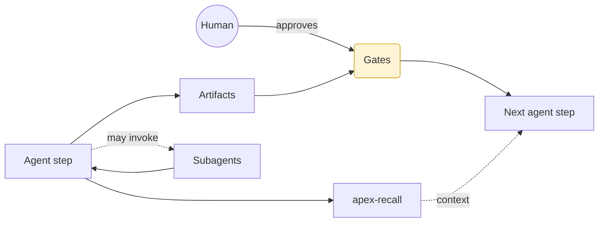
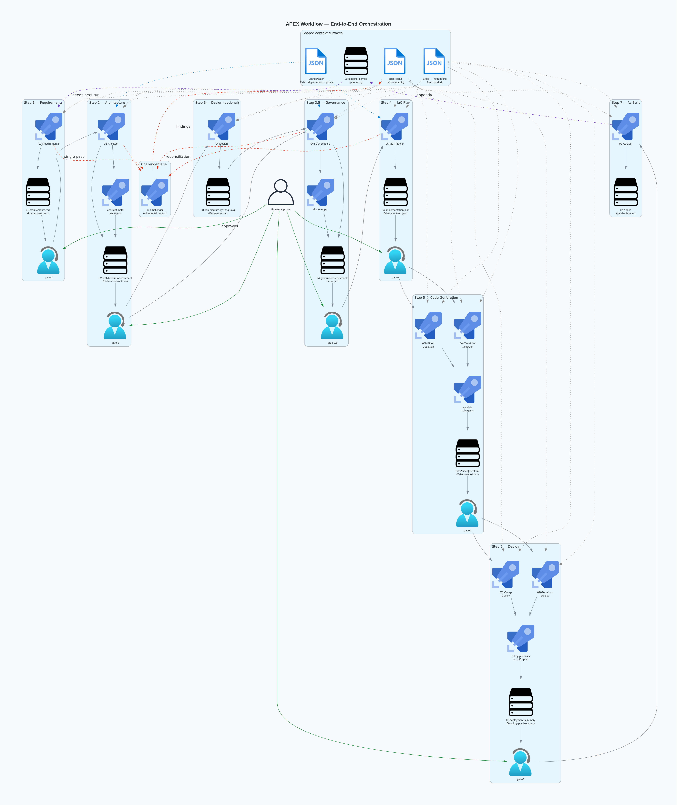
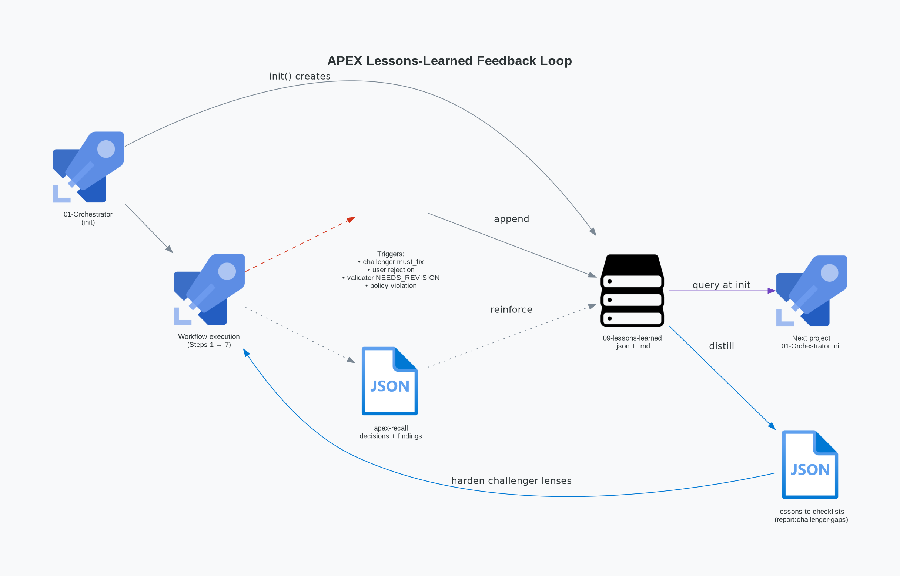
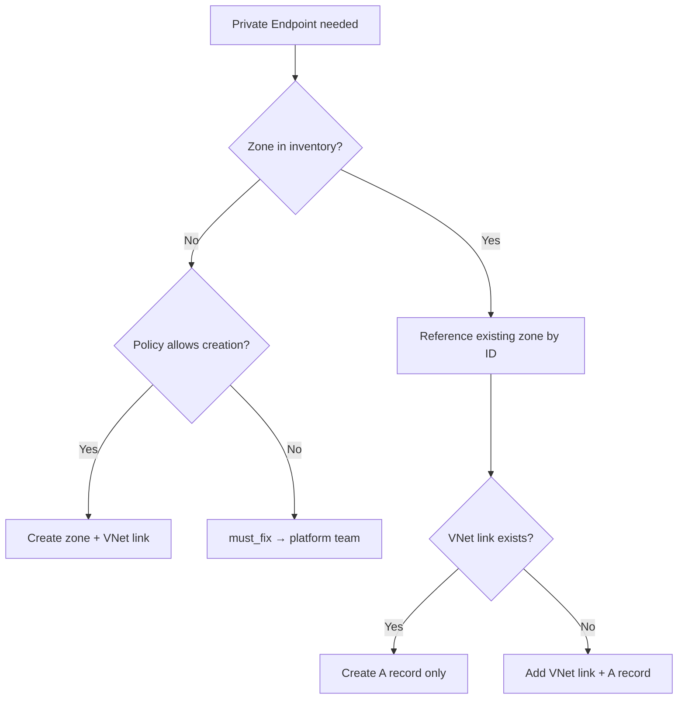

This page is the **long-form integration view** of a single APEX run. Where
[How It Works](../how-it-works/) and [Workflow](../workflow/) are focused
references, this page walks the same pipeline end-to-end and shows how every
cross-cutting mechanic — skills, instructions, registries, `apex-recall`,
hooks, the challenger lane, and the lessons-feedback loop — plugs into each
stage. Use it once, then jump to the focused references for day-to-day work.

:::note[Audience]
Platform engineers, agent authors, and contributors who want a single
narrative tying every moving part together. If you only need the DAG, read
[Workflow Engine & Quality](../how-it-works/workflow-engine/) instead.
:::

## Mental model

APEX is an opinionated, agent-driven pipeline that turns a natural-language
Azure ask into reviewed, deploy-ready Infrastructure-as-Code. Three primitives
do the heavy lifting:

- **Agent steps** — a single Copilot agent owns one stage, produces
  versioned artifacts under `agent-output/{project}/`, and hands off through
  the Orchestrator.
- **Gates** — explicit human or validation checkpoints between steps. The
  workflow does not auto-advance past a gate.
- **Subagent fan-out** — parallel, isolated subagents called by a parent
  agent for adversarial review, cost queries, deployment previews, or
  documentation parallelism. Subagents return structured results and never
  share the parent's context window.

State lives in three deliberately separate places:

| Where                                                          | What                                               | Lifecycle              |
| -------------------------------------------------------------- | -------------------------------------------------- | ---------------------- |
| `agent-output/{project}/`                                      | Versioned artifacts (markdown, JSON, diagrams)     | Per-project, on disk   |
| `apex-recall` session store                                    | Decisions, findings, step status, governance trace | Per-project, queryable |
| `.github/skills/apex-workflow-engine/templates/workflow-graph.json` | DAG — nodes, edges, gates, return edges, plan-lock | Repo-wide, read-only   |



## The five context surfaces

Every step pulls from the same five surfaces. Understanding them once
removes 80% of the apparent "magic".

### Skills

Skills are domain knowledge packs auto-discovered by the `description` field
in each `.github/skills/{name}/SKILL.md`. Agents read `SKILL.md` on demand
and load `references/*.md` only when the body explicitly points to one —
there is no digest tier.

Skills classify as **WORKFLOW** (multi-phase procedures), **ANALYSIS**
(read-only investigations), or **UTILITY** (reusable patterns and defaults).
The catalog is large; the relevant slice per step appears in the
[Skill ↔ Step matrix](#appendix-b--skill--step-matrix).

### Instructions

Instructions are rule files auto-loaded by VS Code Copilot when their
`applyTo` glob matches the file under edit. They never need explicit
invocation. The most consequential ones for a workflow run:

| Instruction                                                                                                                                                            | Triggered by editing                      | Role                                            |
| ---------------------------------------------------------------------------------------------------------------------------------------------------------------------- | ----------------------------------------- | ----------------------------------------------- |
| [`agent-operating-frame`](https://github.com/jonathan-vella/apex/blob/main/.github/instructions/agent-operating-frame.instructions.md)               | `.github/agents/*.agent.md`               | Shared agent operating frame                    |
| [`governance-discovery`](https://github.com/jonathan-vella/apex/blob/main/.github/instructions/governance-discovery.instructions.md)                 | `**/04-governance-constraints.{md,json}`  | Policy-discovery requirements                   |
| [`sku-manifest`](https://github.com/jonathan-vella/apex/blob/main/.github/instructions/sku-manifest.instructions.md)                                 | `**/sku-manifest.{md,json}`               | Authoring + drift contract for the SKU manifest |
| [`iac-plan-best-practices`](https://github.com/jonathan-vella/apex/blob/main/.github/instructions/iac-plan-best-practices.instructions.md)           | `**/04-implementation-plan.md`            | Plan-level policy + cost rules                  |
| [`iac-bicep-best-practices`](https://github.com/jonathan-vella/apex/blob/main/.github/instructions/iac-bicep-best-practices.instructions.md)         | `**/*.bicep`                              | Bicep code rules (AVM, security baseline)       |
| [`iac-terraform-best-practices`](https://github.com/jonathan-vella/apex/blob/main/.github/instructions/iac-terraform-best-practices.instructions.md) | `**/*.tf`                                 | Terraform code rules                            |
| [`azure-artifacts`](https://github.com/jonathan-vella/apex/blob/main/.github/instructions/azure-artifacts.instructions.md)                           | `**/agent-output/**/*.md`                 | H2 template enforcement                         |
| [`no-interactive-shell`](https://github.com/jonathan-vella/apex/blob/main/.github/instructions/no-interactive-shell.instructions.md)                 | chat-loaded agent/skill/instruction files | Bans `-i` flags, `read -p`, heredoc prompts     |
| [`lesson-collection`](https://github.com/jonathan-vella/apex/blob/main/.github/instructions/lesson-collection.instructions.md)                       | `**/*orchestrator*.agent.md`              | Lesson-capture protocol                         |

### `.github/data/` registries

Five JSON/CSV registries are the source of truth for module choice,
deprecation avoidance, and governance fallbacks:

| File                                      | Read by                               | When                                                      |
| ----------------------------------------- | ------------------------------------- | --------------------------------------------------------- |
| `avm-bicep-modules.csv`                   | 05-IaC Planner, 06b-Bicep CodeGen     | Module discovery and pinning                              |
| `avm-terraform-modules.csv`               | 05-IaC Planner, 06t-Terraform CodeGen | Module discovery and pinning                              |
| `avm-module-index.json`                   | 05-IaC Planner, 03-Architect          | Lifecycle status (Available / Proposed / Orphaned) lookup |
| `azure-deprecations.json`                 | 03-Architect, 05-IaC Planner          | Block sunset SKUs early                                   |
| `governance-policy-baseline.json.gz`      | 04g-Governance                        | Compressed fallback baseline when live discovery is empty |
| `governance-policy-baseline.fixture.json` | Validators + tests                    | Deterministic test fixture                                |

### `apex-recall`

All cross-step state flows through the `apex-recall` CLI — agents never
read or write `00-session-state.json` directly. The full schema for
`show --json` lives in
[`tools/apex-recall/docs/show-schema.md`](https://github.com/jonathan-vella/apex/blob/main/tools/apex-recall/docs/show-schema.md);
the valid decision-keys registry lives in
[`tools/apex-recall/docs/decision-keys.md`](https://github.com/jonathan-vella/apex/blob/main/tools/apex-recall/docs/decision-keys.md).

Lifecycle commands used during a run:

```bash
apex-recall init <project> --json                              # new project
apex-recall show <project> --json                              # full context
apex-recall checkpoint <project> <step> <phase> --json         # after each phase
apex-recall complete-step <project> <step> --json              # on completion
apex-recall decide <project> --key <k> --value <v> --json      # record decision
apex-recall finding <project> --add "<text>" --json            # log a finding
apex-recall review-audit <project> <step> ... --json           # after challenger
```

Read-only orientation (used by every agent on resume): `sessions | files |
search '<term>' | decisions`, all `--json`-capable.

### Hooks and validators

Three enforcement layers sit outside the agent prompt:

1. **Lefthook pre-commit pipeline** runs serially on staged files:
   `markdown-lint`, `link-check` (site docs only), `h2-sync`,
   `artifact-validation`, `agents`, `model-catalog-sync`,
   `instructions`, `skill-references`, `sku-manifest-render`,
   `safe-shell`.
2. **Lefthook pre-push** runs `tools/scripts/diff-based-push-check.sh`
   which categorises changed files and fires only matching validators.
3. **GitHub Actions** complement the local hooks with full-repo
   validation on PRs.

The `10-Challenger` adversarial-review wrapper is a separate enforcement
plane — it audits **AI-generated creative decisions** in artifacts, not
file syntax. Hooks and the challenger never overlap responsibilities.

## Stage-by-stage walkthrough

Every stage section follows the same sub-template so it is scannable. Counts
of resources, lenses, or passes come from
[`workflow-graph.json`](https://github.com/jonathan-vella/apex/blob/main/.github/skills/apex-workflow-engine/templates/workflow-graph.json)
— treat that file as authoritative.

### Step 0 — Project Init (Orchestrator boot)

Before Step 1 runs, **01-Orchestrator** initialises the project and
captures two project-scoped decisions that every downstream agent
reads (never re-asked):

- **`iac_tool`** — Bicep or Terraform. Captured at Step 1 Phase 2 by
  `02-Requirements` and persisted via `apex-recall decide … --key
iac_tool`. No default — the user must choose.
- **`review_depth`** — Adversarial-review depth for the whole
  project. Captured at project boot (or first gate after init).
  Default `default` = single-pass `comprehensive` at Steps 1, 2, 4
  plus `governance-reconciliation` at Step 3.5. Opt-in `deep` flips
  every challenger call into the rotating-lens multi-pass cascade
  defined in `adversarial-review-protocol.md`. Persisted via
  `apex-recall decide … --key review_depth`.

Once written, both decisions can be changed only by editing the
`apex-recall` value directly — the orchestrator does not re-prompt.
For a single-artifact deep review without flipping the project, invoke
`10-Challenger` manually. Full contract:
[01-orchestrator.agent.md → `Computing
decisions.review_depth`](https://github.com/jonathan-vella/apex/blob/main/.github/agents/01-orchestrator.agent.md#computing-decisionsreview_depth-project-scoped-opt-in).

### Step 1 — Requirements

- **Purpose & inputs** — Capture the project intent and pin the SKU
  manifest revision 1. `requires: []`; `produces: 01-requirements.md`,
  `sku-manifest.json`, `sku-manifest.md`.
- **Driving agent** — `02-Requirements` (no subagents).
- **Skills auto-loaded** — `apex-azure-defaults` (regions, tags, naming),
  `apex-azure-artifacts` (H2 templates).
- **Instructions activated** — `agent-operating-frame`, `apex-azure-artifacts`,
  `sku-manifest`, `no-interactive-shell`.
- **Data sources** — none beyond user answers; lessons from prior runs are
  optionally surfaced by Orchestrator init.
- **`apex-recall` touchpoints** — `init`, `decide` (sets `iac_tool`,
  `region`, `complexity`, `relational_db`), `checkpoint` per phase,
  `complete-step 1`.
- **Artifacts** — `agent-output/{project}/01-requirements.md`,
  `sku-manifest.{json,md}` (empty `services[]` is the common case;
  user-pinned SKUs only).
- **Challenger review** — single-pass `comprehensive` (mandatory).
- **Gate & approval** — `gate-1` blocks until the human approves
  `01-requirements.md`.
- **Hooks on commit** — `markdown-lint`, `artifact-validation`,
  `sku-manifest-render`.
- **Common failures** — under-specified non-functional requirements;
  caught by the challenger and routed back via the `step-1 → step-1`
  self-refine edge.

### Step 2 — Architecture

- **Purpose & inputs** — Produce WAF-pillar-scored architecture and a
  cost estimate. `requires: gate-1`; mutates `sku-manifest`.
- **Driving agent** — `03-Architect` with `cost-estimate-subagent`.
- **Skills auto-loaded** — `apex-azure-defaults`, `apex-azure-artifacts`,
  `apex-microsoft-docs` (on demand), `apex-context-management`.
- **Instructions activated** — `agent-operating-frame`, `apex-azure-artifacts`,
  `sku-manifest`.
- **Data sources** — `avm-module-index.json` (lifecycle status),
  `azure-deprecations.json`, Azure Resource Manager MCP (via subagent).
- **`apex-recall`** — `checkpoint` per phase; `decide` for review-depth
  default; cost estimate stored as artifact, summary in findings.
- **Artifacts** — `02-architecture-assessment.md`,
  `03-des-cost-estimate.md`, `03-des-sku-comparison.md` (when SKU
  trade-offs exist), mutated `sku-manifest`.
- **Challenger review** — single-pass `comprehensive` (mandatory).
  `decisions.review_depth = "deep"` opts into rotating-lens multi-pass
  (`security-governance`, `architecture-reliability`, optionally
  `cost-feasibility`).
- **Gate & approval** — `gate-2`.
- **Hooks on commit** — `markdown-lint`, `artifact-validation`,
  `sku-manifest-render`.
- **Common failures** — orphaned/proposed AVM modules selected
  (caught by `avm-module-index.json` check), missing private-endpoint
  story (caught by `security-governance` lens on deep review).

### Step 3 — Design (optional)

- **Purpose & inputs** — Architecture diagrams + ADRs.
  `requires: gate-2`; produces `03-des-diagram.{py,png,svg}`, `03-des-adr-*.md`.
- **Driving agent** — `04-Design`. Optional — users can skip directly to
  Step 3.5 governance.
- **Skills auto-loaded** — `apex-python-diagrams`, `apex-azure-adr`,
  `apex-azure-defaults`, `apex-azure-artifacts`.
- **Instructions activated** — `apex-azure-artifacts`,
  `agent-operating-frame`.
- **Data sources** — `avm-module-index.json` for module-aware diagrams.
- **`apex-recall`** — `checkpoint`, `complete-step 3`.
- **Artifacts** — Python source with PNG/SVG renders; one ADR file per material
  decision.
- **Challenger review** — opt-in only; scope `design-adr` if invoked.
- **Gate & approval** — no gate; flows directly to Step 3.5.
- **Hooks on commit** — `markdown-lint`, `link-check` for ADR references.
- **Common failures** — diagrams drifting from the architecture
  assessment; surfaced at Step 7 drift detection.

### Step 3.5 — Governance

- **Purpose & inputs** — Discover effective Azure Policy assignments
  (incl. management-group-inherited) for the target subscription and
  reconcile them with the approved architecture. `requires: gate-2`.
- **Driving agent** — `04g-Governance`, invoking
  `.github/skills/apex-azure-governance-discovery/scripts/discover.py`.
- **Skills auto-loaded** — `apex-azure-governance-discovery`, `apex-azure-defaults`,
  `apex-azure-artifacts`, `apex-iac-common` (drift routing).
- **Instructions activated** — `governance-discovery` (mandatory policy
  contract), `apex-azure-artifacts`.
- **Data sources** — Azure Policy REST API (live);
  `governance-policy-baseline.json.gz` as documented fallback.
- **`apex-recall`** — `checkpoint`, `decide --key governance_depth`,
  records the **L0 discovery envelope** as the first link in the
  attestation chain.
- **Artifacts** — `04-governance-constraints.md` + `.json` (with
  `discovery_metadata` envelope).
- **Challenger review** — single-pass `governance-reconciliation`.
  Skipped when `constraints.count == 0`.
- **Gate & approval** — `gate-2.5`. Precondition: reconciliation
  must not be `escalated_to_step-2`; if it is, the gate stays closed and
  Step 2 must re-approve before reconciliation re-runs. This closes the
  governance-vs-architecture livelock.
- **Hooks on commit** — `markdown-lint`, `artifact-validation` (governance
  JSON has a dedicated schema check).
- **Common failures** — Deny-effect policy on a planned resource;
  routed back to Architect via `step-3_5 → step-2` return edge
  (`on_must_fix_governance_conflict`).

### Step 4 — IaC Plan

- **Purpose & inputs** — Produce a machine-readable implementation plan
  with frozen inputs for code generation. `requires: gate-2.5`; mutates
  `sku-manifest`.
- **Driving agent** — `05-IaC Planner` (a Sonnet 4.6 agent that branches
  Bicep vs Terraform via `decisions.iac_tool`).
- **Skills auto-loaded** — `apex-azure-defaults`, `apex-azure-artifacts`,
  `apex-python-diagrams`, `apex-iac-common` (plan-consistency-checks +
  governance-drift-routing), and **track-specific**
  `apex-azure-bicep-patterns` or `apex-terraform-patterns`.
- **Instructions activated** — `iac-plan-best-practices`,
  `apex-azure-artifacts`, `sku-manifest`.
- **Data sources** — `avm-bicep-modules.csv` /
  `avm-terraform-modules.csv` (pinning), `avm-module-index.json`
  (lifecycle), `azure-deprecations.json`, governance constraints from
  Step 3.5.
- **`apex-recall`** — `checkpoint` per phase; writes the **L1 governance
  attestation** (Governance Compliance Matrix H2); records
  `decisions.governance_trace`.
- **Artifacts** — `04-implementation-plan.md` (with `## 🛡️ Governance
Compliance Matrix` and `## 📤 Code-Generation Contract` H2s),
  `04-iac-contract.json`, `04-policy-property-map.json`,
  `04-environment-manifest.json`, dependency + runtime
  Python-diagrams (`.py` + `.png`).
- **Challenger review** — single-pass `comprehensive` (mandatory).
  Deep-depth opts into rotating lenses (same matrix as Step 2).
- **Gate & approval** — `gate-3`. Two preconditions:
  1. `plan-readiness` — all challenger passes APPROVED.
  2. `plan-architecture-escalation` — anti-livelock: any finding with
     `requires_step == "step-2"` re-opens the gate and traverses the
     `step-4 → step-2` `on_architecture_must_fix` edge.
- **Hooks on commit** — `markdown-lint`, `artifact-validation`,
  `sku-manifest-render`, `agents`/`instructions` if the planner agent
  was edited.
- **Common failures** — AVM module lifecycle drift; missing private
  endpoint on a data-tier resource; deny-policy conflict surfaced late.

### Step 5 — Code Generation

- **Purpose & inputs** — Emit ready-to-deploy IaC. `requires: gate-3`;
  inputs are **frozen** (plan-lock) and read-only.
- **Driving agents** — `06b-Bicep CodeGen` or `06t-Terraform CodeGen`,
  each calling its track's validate subagent.
- **Skills auto-loaded** — `apex-azure-defaults`, `apex-azure-artifacts`,
  `apex-azure-bicep-patterns` or `apex-terraform-patterns`, `apex-iac-common`,
  `apex-context-management`.
- **Instructions activated** — `iac-bicep-best-practices` or
  `iac-terraform-best-practices`, `agent-operating-frame`.
- **Data sources** — same AVM CSV + index; policy-property-map and
  environment-manifest from Step 4.
- **`apex-recall`** — `checkpoint` per phase; writes the **L2
  attestation** rows; never edits frozen plan artifacts.
- **Artifacts** — `infra/bicep/{project}/` or `infra/terraform/{project}/`,
  `05-iac-handoff.json`.
- **Challenger review** — opt-in only (`artifact_scope: iac-code`);
  default skips. Plan-level findings _return_ to Step 4 via the
  `step-5b|t → step-4` `on_refine` edge — they never self-edit the plan.
- **Gate & approval** — `gate-4` is a validation gate (lint, build,
  `bicep build` / `terraform validate` clean).
- **Hooks on commit** — `validate:iac-security-baseline` and IaC-specific
  validators via the pre-push diff check.
- **Common failures** — hallucinated AVM parameters (caught by
  `bicep build` / `terraform validate`); attempts to self-edit the
  frozen plan (caught by `plan_readonly` enforcement and routed back).

### Step 6 — Deploy

- **Purpose & inputs** — Execute the deployment with safety nets.
  `requires: gate-4`; mutates `sku-manifest` on quota/region substitution.
- **Driving agents** — `07b-Bicep Deploy` (preferring `azd provision`)
  or `07t-Terraform Deploy`. Each calls `policy-precheck-subagent`
  (L3 live policy check) plus `bicep-whatif-subagent` /
  `terraform-plan-subagent`.
- **Skills auto-loaded** — `apex-azure-defaults`, `apex-azure-artifacts`,
  `apex-iac-common` (circuit-breaker, deploy-shared-workflow,
  policy-precheck-contract, governance-drift-routing).
- **Instructions activated** — `azure-yaml` if `azure.yaml` is edited;
  `iac-bicep-best-practices` or `iac-terraform-best-practices`.
- **Data sources** — live Azure Policy state via the precheck subagent;
  Azure Resource Manager for what-if / plan.
- **`apex-recall`** — precondition: `decisions.governance_trace` must be
  present (full L0 → L1 → L2 → L3 chain) before `az deployment create`
  / `azd provision` / `terraform apply`.
- **Artifacts** — `06-deployment-summary.md`,
  `06-policy-precheck.json`. The deployment summary folds the precheck
  into an informational H2 — no separate review.
- **Challenger review** — none (deploy artifacts are tool output, not
  creative decisions).
- **Gate & approval** — `gate-5` after human approval. On failure, the
  `step-6 → step-5` `on_fail` edge returns to CodeGen; on architecture
  gap surfaced at deploy time, `step-6 → step-2` `on_refine` returns to
  Architect.
- **Hooks on commit** — `markdown-lint`, `artifact-validation`.
- **Common failures** — quota exhaustion (handled via
  block-with-escalation substitution + `sku-manifest` mutation), policy
  Deny at apply time, transient ARM 5xx (handled by the `apex-iac-common`
  circuit breaker).

### Step 7 — As-Built

- **Purpose & inputs** — Produce the as-built documentation suite from
  the deployed resource state. `requires: gate-5`.
- **Driving agent** — `08-As-Built` (subagent fan-out, no further
  challenger). Seven parallel substeps: design document, operations
  runbook, cost estimate, compliance matrix, backup/DR plan, resource
  inventory, documentation index.
- **Skills auto-loaded** — `apex-azure-defaults`, `apex-azure-artifacts`,
  `apex-python-diagrams`, `apex-context-management` (Mode A compression).
- **Instructions activated** — `apex-azure-artifacts`,
  `markdown-docs` (for any docs-site copy).
- **Data sources** — live Azure Resource Manager (resource inventory);
  `sku-manifest` for bidirectional drift detection.
- **`apex-recall`** — `checkpoint` per substep; `complete-step 7`.
- **Artifacts** — `07-design-document.md`, `07-operations-runbook.md`,
  `07-ab-cost-estimate.md`, `07-compliance-matrix.md`,
  `07-backup-dr-plan.md`, `07-resource-inventory.md`,
  `07-documentation-index.md`; final `sku-manifest` mutation captures
  drift.
- **Challenger review** — none.
- **Gate & approval** — no gate; documentation set is the terminal
  artifact.
- **Hooks on commit** — `markdown-lint`, `artifact-validation`,
  `sku-manifest-render`.
- **Common failures** — drift between planned and deployed SKUs; bubbled
  into lessons-learned for the next run.

### Post — Lessons

The Orchestrator follows the `lesson-collection` protocol throughout the
run (not just at the end). Triggers: challenger `must_fix`, user
rejection, subagent `NEEDS_REVISION`, Azure Policy violation surfaced
at what-if, explicit user concern. Each trigger appends one lesson to
`09-lessons-learned.json`; the markdown twin renders at workflow
completion.

## End-to-end run timeline

The diagram below collapses every step into a single orchestration view
showing agent → subagent → gate → artifact lanes plus the shared
context surfaces (skills, `apex-recall`, registries, lessons store) and
the challenger lane.



Per-stage routing details (gate preconditions, return edges) stay inline
as Mermaid in each stage section above — this diagram is the spatial
overview.

## The lessons-learned feedback loop

`09-lessons-learned.json` is **initialised at Orchestrator init**,
appended throughout execution by the lesson-collection triggers, and
queried by the next project's Orchestrator at its own init. Findings
and decisions recorded in `apex-recall` reinforce the lessons store —
the two stores are complementary, not redundant.



The `tools/scripts/lessons-to-checklists.mjs` script
(`npm run report:challenger-gaps`) distils recurring lessons into
candidate hardening for the challenger lenses themselves — the loop
also closes back into the reviewer.

### Illustrative lesson entry

The schema lives in
[`tools/schemas/lesson-log.schema.json`](https://github.com/jonathan-vella/apex/blob/main/tools/schemas/lesson-log.schema.json).
The entry below is **fabricated for illustration only** and never
appeared in a real run:

```json title="agent-output/{project}/09-lessons-learned.json (illustrative)" frame="code"
{
  "workflow_mode": "production",
  "project": "{project}",
  "lessons": [
    {
      "step": 4,
      "phase": "phase_3_module_selection",
      "category": "factual-accuracy",
      "trigger": "challenger must_fix",
      "observation": "Planner pinned avm/res/storage/storage-account at a version that lacked the requireInfrastructureEncryption flag required by an inherited deny policy.",
      "root_cause": "AVM module-index lifecycle was Available but the version chosen predated the policy property.",
      "action": "Move policy-property-map.json check earlier in Phase 2, before module pinning.",
      "telemetry": { "iterations": 2, "wall_time_min": 18 }
    }
  ]
}
```

## APEX and Azure Landing Zones

APEX assumes that an [Azure Landing Zone (ALZ)](https://learn.microsoft.com/azure/cloud-adoption-framework/ready/landing-zone/)
is already deployed. ALZ provides the **platform-level guardrails** — management
group hierarchy, Azure Policy assignments, RBAC role definitions, connectivity
(hub-spoke or Virtual WAN), and identity — that APEX consumes rather than
recreates. Understanding this boundary is critical: APEX operates _inside_ the
landing zone, not _instead of_ it.

### What greenfield means in APEX

In APEX, **"greenfield" refers to a net-new application or workload project** —
the application code, its IaC, and the surrounding pipeline artifacts are being
created from scratch. It says nothing about the target Azure environment, which
may be a mature ALZ tenant with strict inherited policies, a partially
configured subscription, or a freshly minted empty subscription.

This matters because two unrelated concepts often get collapsed under the same
word:

- **Application-greenfield (APEX sense)** — no prior app code, no prior IaC for
  this workload. APEX is designed for this case, and the "greenfield CAF tag
  fallback" in
  [`apex-azure-defaults/references/tag-strategy.md`](https://github.com/jonathan-vella/apex/blob/main/.github/skills/apex-azure-defaults/references/tag-strategy.md)
  uses this sense.
- **Environment-greenfield** — no ALZ, no inherited policy, an empty
  subscription. APEX handles this separately via the no-ALZ fallback documented
  in [When there is no landing zone](#when-there-is-no-landing-zone) below.

The two cases are independent: an application-greenfield project can land in a
mature ALZ, and an environment-greenfield subscription can host a brownfield
migration. APEX assumes ALZ is present by default; the no-ALZ fallback is a
documented exception, not the norm.

### What ALZ provides

| ALZ layer                    | What it gives APEX                                                                                                                                                                                                         |
| ---------------------------- | -------------------------------------------------------------------------------------------------------------------------------------------------------------------------------------------------------------------------- |
| **Management groups**        | Inheritance scope for Azure Policy. The `governance-policy-baseline` workflow crawls this hierarchy at Step 3.5.                                                                                                           |
| **Azure Policy**             | Deny/audit/DINE rules for security, tagging, allowed regions, allowed SKUs. APEX discovers these live and encodes them into `04-governance-constraints.json`.                                                              |
| **Connectivity**             | Hub VNet or Virtual WAN hub with ExpressRoute/VPN gateways, Azure Firewall or NVA, and centralized Private DNS Zones.                                                                                                      |
| **Identity**                 | Entra ID tenant, privileged identity governance, break-glass accounts. APEX assumes Managed Identity and Entra-only auth.                                                                                                  |
| **Logging**                  | Central Log Analytics workspace + Defender for Cloud assignment. APEX references the existing workspace rather than creating per-workload workspaces.                                                                      |
| **Diagnostics & monitoring** | The Log Analytics workspace resource ID is surfaced through governance discovery and wired into every Azure resource via the platform's diagnostic-settings policy/module. APEX consumes the ID — it never provisions one. |

#### ALZ layer → APEX step consumer

This matrix maps each ALZ layer to the APEX step that reads it and the
artifact or decision key where the value lands.

| ALZ layer                       | APEX step that consumes it  | Where it lands                                                             |
| ------------------------------- | --------------------------- | -------------------------------------------------------------------------- |
| Management groups               | Step 3.5 (`04g-Governance`) | `04-governance-constraints.json` (`discovery_metadata.scope`)              |
| Azure Policy                    | Step 3.5 + Step 4           | `04-governance-constraints.{md,json}`; Step 4 Governance Compliance Matrix |
| Connectivity (hub-spoke / vWAN) | Step 2 Phase 6b + Step 4    | `decisions.vnet_mode`, `decisions.existing_vnet_id`; Step 4 plan           |
| Identity                        | Step 4 + Step 5             | `decisions.identity_model`; least-privilege role assignments in IaC        |
| Logging                         | Step 5 (CodeGen)            | Diagnostic-settings module wiring per resource                             |
| Diagnostics workspace           | Step 5 + Step 7             | Diagnostic-settings module ID; Step 7 compliance matrix                    |

### How ALZ guardrails accelerate and de-risk APEX

| Accelerator                       | How ALZ provides it                                                                                                             | How APEX consumes it                                                                                                                                                                                        |
| --------------------------------- | ------------------------------------------------------------------------------------------------------------------------------- | ----------------------------------------------------------------------------------------------------------------------------------------------------------------------------------------------------------- |
| **Pre-populated governance**      | Policy assignments inherited from management-group scopes.                                                                      | Step 3.5 (`04g-Governance`) discovers required tags, denied public endpoints, mandatory encryption directly — challenger review becomes a reconciliation pass against known facts, not a speculative audit. |
| **Overlapping security baseline** | Tenant-wide Azure Policy enforces TLS, public-access denials, and stricter rules (e.g. deny public network access on all PaaS). | APEX's non-negotiable baseline (TLS 1.2+, HTTPS-only, no public blob, Managed Identity) is a _subset_; when ALZ is stricter, Step 3.5 captures the stricter rule and the IaC Planner honours it at Step 4.  |
| **Known network boundaries**      | Address spaces, peering topology, DNS resolution, firewall rules pre-established.                                               | The VNet planning gate (Architect Phase 6b) slots a spoke into the existing topology instead of designing one from scratch — selected via `decisions.vnet_mode = use-existing`.                             |
| **Scoped RBAC**                   | Platform team pre-assigns roles at subscription / resource-group scope.                                                         | APEX records `decisions.identity_model` and generates least-privilege role assignments that fit within the existing RBAC structure, validated by the `apex-azure-rbac` skill.                                    |
| **Compounding cost governance**   | Subscription-level budget alerts + cost-management policies.                                                                    | APEX's per-project cost-monitoring baseline (Wave 4 of CodeGen) stacks beneath ALZ: ALZ catches subscription-wide anomalies, APEX catches project-level overruns.                                           |

### When there is no landing zone

If the target subscription has no inherited policies (the `governance-policy-baseline`
workflow returns an empty envelope), APEX falls back to the **no-ALZ defaults**
documented in `apex-azure-defaults`: lowercase 4-tag set, `swedencentral` region,
and the full non-negotiable security baseline. The challenger review flags the
absence of inherited guardrails as an informational finding so the team is
aware they are operating without platform-level safety nets. This is the
_environment_ sense of "greenfield" — see
[What greenfield means in APEX](#what-greenfield-means-in-apex) for the
disambiguation. The no-ALZ fallback is orthogonal to whether the application
itself is new.

## Network planning

APEX's VNet planning gate — triggered at Architect Phase 6b — handles the two
scenarios that arise in an ALZ environment: **bring your own VNet** (spoke
already provisioned by the platform team) or **create a new VNet** (spoke
provisioned by APEX inside an application landing zone subscription).

### Bring your own VNet vs. create new

The user chooses via `decisions.vnet_mode`:

| Mode               | When to use                                                                                                                     | What APEX does                                                                                                                                                                                            |
| ------------------ | ------------------------------------------------------------------------------------------------------------------------------- | --------------------------------------------------------------------------------------------------------------------------------------------------------------------------------------------------------- |
| **`use-existing`** | Platform team pre-provisions spoke VNets, peering, UDRs, and NSGs centrally. Common in regulated environments.                  | Validates the VNet exists (`az network vnet show`), imports its address space, and plans subnets within the existing CIDR. IaC code references the VNet by resource ID — it does not create or modify it. |
| **`create-new`**   | Application teams own their spoke lifecycle, or the workload lands in a dedicated subscription with no pre-provisioned network. | Generates a full VNet module (AVM-first), with subnets sized per the workload's SKU-aware subnet matrix. The Planner wires peering to the hub if the architecture calls for it.                           |

The choice is captured by `apex-recall decide --key vnet_mode` and flows to
the IaC Planner (Step 4) and CodeGen (Step 5). When `vnet_mode = use-existing`,
CodeGen emits a `data` source (Terraform) or an `existing` resource reference
(Bicep) — never a `create` block for the VNet itself.

**Decision capture.** The VNet planning gate persists registered apex-recall
keys plus two proposed ones that describe behaviour the planner already
exhibits:

- [`decisions.vnet_mode`](https://github.com/jonathan-vella/apex/blob/main/tools/apex-recall/docs/decision-keys.md)
  — `create-new` or `use-existing` (**registered**).
- [`decisions.existing_vnet_id`](https://github.com/jonathan-vella/apex/blob/main/tools/apex-recall/docs/decision-keys.md)
  — required when `vnet_mode = use-existing` (**registered**).
- [`decisions.identity_model`](https://github.com/jonathan-vella/apex/blob/main/tools/apex-recall/docs/decision-keys.md)
  — `managed-identity` (default) or one of the alternatives (**registered**).
- `decisions.hub_topology` — `hub-spoke` or `virtual-wan` (**proposed**, not
  yet in `decision-keys.md`).
- `decisions.dns_zone_strategy` — `central-reference` / `spoke-create` /
  `escalate` (**proposed**, not yet in `decision-keys.md`).

Registering the two proposed keys in `decision-keys.md` and the apex-recall
CLI validator is deferred to a follow-up PR so this documentation change ships
standalone.

### Hub-spoke and Virtual WAN topologies

Both ALZ connectivity models — **hub-spoke** (Azure Firewall / NVA in a hub
VNet) and **Virtual WAN** (Microsoft-managed hub with integrated routing) —
are supported. APEX does not provision the hub or the WAN itself; it provisions
the spoke and assumes connectivity to the hub is established via peering
(hub-spoke) or a Virtual WAN VNet connection (vWAN). The subnet plan produced
at Phase 6b accounts for hub-side constraints such as forced-tunnel UDRs and
NSG rules inherited from ALZ policy. The canonical subnet sizing matrix and
the two-step existing-VNet validation live in
[`apex-azure-defaults/references/vnet-planning.md`](https://github.com/jonathan-vella/apex/blob/main/.github/skills/apex-azure-defaults/references/vnet-planning.md).

### Private DNS Zones — enumeration and reuse

In a well-architected ALZ, **Private DNS Zones live centrally** — typically in
a connectivity subscription or a shared-services resource group — and are
linked to the hub VNet (or the Virtual WAN hub's DNS proxy). When a spoke
workload creates a private endpoint, it registers an A record in the
appropriate zone (e.g. `privatelink.vaultcore.azure.net` for Key Vault).

APEX handles DNS zone resolution in a pattern analogous to governance policy
discovery:

1. **Enumeration.** A scheduled GitHub Actions workflow (following the same
   pattern as the `governance-policy-baseline` workflow) can query the target
   subscription and connected scopes for existing Private DNS Zones via
   `az network private-dns zone list`. The result — a JSON inventory of zone
   names, resource IDs, and VNet links — is committed to `.github/data/` as a
  checked-in baseline, just as `governance-policy-baseline.json.gz` captures
   policy state.

  The proposed inventory file would parallel `governance-policy-baseline.json.gz`
   in shape (filename `private-dns-zone-baseline.json` is **proposed** — the
   file is not committed today):

   ```json
   {
     "discovery_metadata": {
       "discovered_at": "2026-05-21T12:00:00Z",
       "scope": "/subscriptions/<connectivity-sub-id>",
       "source": "live"
     },
     "zones": [
       {
         "name": "privatelink.vaultcore.azure.net",
         "resource_id": "/subscriptions/.../privateDnsZones/privatelink.vaultcore.azure.net",
         "subscription_id": "<connectivity-sub-id>",
         "vnet_links": [{ "vnet_id": "/subscriptions/.../virtualNetworks/hub-vnet", "registration_enabled": false }],
         "linked_services": ["keyvault"]
       }
     ]
   }
   ```

1. **Decision at plan time.** When the IaC Planner encounters a service that
   requires a private endpoint, it checks whether the corresponding
   `privatelink.*` zone already exists in the enumerated inventory:
   - **Zone exists centrally** — the plan references the zone by resource ID
     and creates only the DNS record group (A record) for the private endpoint.
     No new zone is created.
   - **Zone does not exist and policy allows creation** — the plan includes a
     new Private DNS Zone resource (AVM module) linked to the spoke VNet. This
     is the common path for greenfield environments or when a particular
     `privatelink.*` zone is not yet provisioned centrally.
   - **Zone does not exist and policy denies creation** — the Step 3.5
     governance constraints (or a live `deny` policy on
     `Microsoft.Network/privateDnsZones`) block the creation. The planner
     raises a `must_fix` finding that routes back to the Architect (or to the
     platform team for manual provisioning).

2. **VNet link wiring.** When using a centrally managed zone, the plan creates
   a VNet link from the zone to the spoke VNet (if one does not already exist).
   When creating a new zone, the link is part of the same module.



This three-way branch ensures that APEX never duplicates a centrally managed
DNS zone (which would break resolution), never violates a deny policy, and
always degrades gracefully to a human escalation when the platform team needs
to act.

### Recommended Corp enforcement pattern

:::tip[Recommended ALZ enforcement]
Under Corp landing zones, encode the spoke-side network model with Azure Policy
at the management-group scope so APEX never has to choose between the three
DNS branches at runtime:

- **Deny `Microsoft.Network/privateDnsZones`** creation in workload
  subscriptions. Forces "zone exists centrally" to always win for the standard
  `privatelink.*` zones.
- **DeployIfNotExists (DINE)** for Private Endpoint → Private DNS A record
  auto-registration in the hub-resident zones — the built-in
  [Private Endpoint DNS policy initiative](https://learn.microsoft.com/azure/private-link/private-endpoint-dns-integration#built-in-policy-initiatives)
  covers the standard `privatelink.*` set.
- **DINE** for VNet peering: when a spoke VNet is created, policy auto-peers
  it to the hub.

**Why this simplifies identity and access management.** Spoke teams never need
Network Contributor or Private DNS Zone Contributor on hub resources; the
platform team owns the policy assignments, and DINE remediation runs under a
managed identity that the platform team controls. APEX spoke code becomes pure
data-plane: it creates the Private Endpoint, and the DNS record + peering
appear automatically.

Tying back to the three-way DNS branch above: under this pattern, branch 2
("zone missing + policy allows") becomes impossible by design, branch 1
("zone exists centrally") is the only valid outcome, and branch 3 (`must_fix`)
escalations reduce to genuinely new `privatelink.*` zones the platform hasn't
onboarded yet.
:::

## Appendix A — Artifact contract reference

The full H2 templates for every `agent-output/` artifact live in
[`apex-azure-artifacts/SKILL.md`](https://github.com/jonathan-vella/apex/blob/main/.github/skills/apex-azure-artifacts/SKILL.md)
and its `templates/` folder. The SKU manifest contract lives in
[`sku-manifest.instructions.md`](https://github.com/jonathan-vella/apex/blob/main/.github/instructions/sku-manifest.instructions.md);
the governance JSON shape is documented inside
[`governance-discovery.instructions.md`](https://github.com/jonathan-vella/apex/blob/main/.github/instructions/governance-discovery.instructions.md).
This page deliberately links rather than duplicates.

## Appendix B — Skill ↔ Step matrix

| Step | Always-loaded skills                                                                             | On-demand skills                                   |
| ---- | ------------------------------------------------------------------------------------------------ | -------------------------------------------------- |
| 1    | `apex-azure-defaults`, `apex-azure-artifacts`                                                              | `apex-microsoft-docs`                                   |
| 2    | `apex-azure-defaults`, `apex-azure-artifacts`, `apex-context-management`                                        | `apex-microsoft-docs`, `apex-azure-compute`, `apex-azure-storage` |
| 3    | `apex-azure-defaults`, `apex-azure-artifacts`, `apex-azure-adr`                                                 | `apex-python-diagrams`                                  |
| 3.5  | `apex-azure-defaults`, `apex-azure-artifacts`, `apex-azure-governance-discovery`, `apex-iac-common`                  | `apex-microsoft-docs`                                   |
| 4    | `apex-azure-defaults`, `apex-azure-artifacts`, `apex-iac-common`, `apex-python-diagrams`, track-specific patterns    | `apex-microsoft-docs`, `apex-azure-rbac`                     |
| 5    | `apex-azure-defaults`, `apex-azure-artifacts`, track-specific patterns, `apex-iac-common`, `apex-context-management` | `apex-azure-rbac`, `apex-entra-app-registration`             |
| 6    | `apex-azure-defaults`, `apex-azure-artifacts`, `apex-iac-common`                                                | `apex-azure-quotas`, `apex-azure-validate`, `apex-azure-deploy`   |
| 7    | `apex-azure-defaults`, `apex-azure-artifacts`, `apex-python-diagrams`, `apex-context-management`                     | `apex-azure-resources`, `apex-azure-compliance`              |

## Appendix C — Instruction ↔ trigger matrix

| Instruction                    | `applyTo` glob                            | Effective at step  |
| ------------------------------ | ----------------------------------------- | ------------------ |
| `agent-operating-frame`        | `.github/agents/*.agent.md`               | All                |
| `apex-azure-artifacts`              | `**/agent-output/**/*.md`                 | 1–7                |
| `sku-manifest`                 | `**/sku-manifest.{md,json}`               | 1, 2, 3.5, 4, 6, 7 |
| `governance-discovery`         | `**/04-governance-constraints.{md,json}`  | 3.5                |
| `iac-plan-best-practices`      | `**/04-implementation-plan.md`            | 4                  |
| `iac-bicep-best-practices`     | `**/*.bicep`                              | 5b, 6b             |
| `iac-terraform-best-practices` | `**/*.tf`                                 | 5t, 6t             |
| `azure-yaml`                   | `**/azure.yaml`                           | 5, 6               |
| `lesson-collection`            | `**/*orchestrator*.agent.md`              | Throughout         |
| `no-interactive-shell`         | chat-loaded agent/skill/instruction files | Authoring only     |
| `no-hardcoded-counts`          | repo-wide markdown + scripts              | Authoring only     |
| `markdown-docs`                | `site/src/content/docs/**`, `docs/**`     | Doc authoring      |

## Appendix D — Glossary

Terse pointers only — full definitions live in the linked concept docs.

| Term              | See                                                                                                                                                                          |
| ----------------- | ---------------------------------------------------------------------------------------------------------------------------------------------------------------------------- |
| Challenger / lens | [Workflow Engine & Quality](../how-it-works/workflow-engine/)                                                                                                                   |
| Gate              | [Workflow Engine & Quality](../how-it-works/workflow-engine/)                                                                                                                   |
| Fan-out           | [Agent Architecture](../how-it-works/agents/)                                                                                                                                   |
| Frozen inputs     | `workflow-graph.json` `plan_lock` block (linked above)                                                                                                                       |
| L0–L3 attestation | [`workflow-graph.json` `attestation_chain`](https://github.com/jonathan-vella/apex/blob/main/.github/skills/apex-workflow-engine/templates/workflow-graph.json) |
| Skill tiers       | [Skills & Instructions](../how-it-works/skills-and-instructions/)                                                                                                               |

## Appendix E — Further reading

- [How It Works — Overview](../how-it-works/)
- [System Architecture](../how-it-works/architecture/)
- [Agent Architecture](../how-it-works/agents/)
- [Skills & Instructions](../how-it-works/skills-and-instructions/)
- [Workflow Engine & Quality](../how-it-works/workflow-engine/)
- [MCP Integration](../how-it-works/mcp-integration/)
- [SKU Manifest](../how-it-works/sku-manifest/) (when present)
- Repository root: [`AGENTS.md`](https://github.com/jonathan-vella/apex/blob/main/AGENTS.md)
- Vendor docs: [Anthropic Claude prompting guide](https://docs.anthropic.com/en/docs/build-with-claude/prompt-engineering/overview),
  [OpenAI GPT-5 prompting guide](https://platform.openai.com/docs/guides/prompt-engineering)
