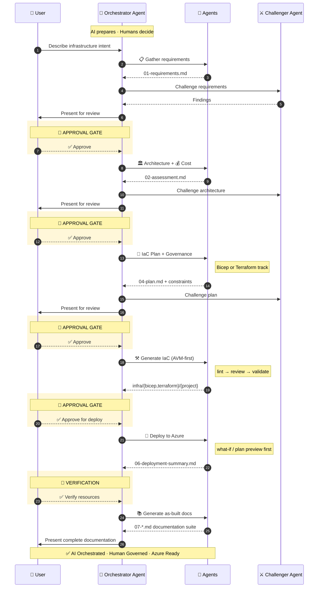

# Agent and Skill Workflow

The multi-step platform engineering workflow.

## Overview

APEX uses a multi-agent orchestration system where specialized AI agents coordinate
through artifact handoffs to transform Azure project requirements into deployed infrastructure
code. The system supports **dual IaC tracks** — Bicep and Terraform — sharing common requirements,
architecture, design, and governance steps (1-3.5) then diverging into track-specific planning,
code generation, and deployment (steps 4-6) before converging again for documentation (step 7).

The **Orchestrator** (🧠 Orchestrator)
orchestrates the complete workflow, routing to
Bicep or Terraform agents based on the `iac_tool` field in `01-requirements.md`,
while enforcing mandatory approval gates.

:::tip[Quick Start]
Press ++ctrl+shift+i++ to open Copilot Chat, select **Orchestrator**, and
describe your project. The Orchestrator handles all steps with approval gates.
:::

### Formalized Workflow Engine

A machine-readable DAG (Directed Acyclic Graph) in
`.github/skills/apex-workflow-engine/templates/workflow-graph.json` encodes the workflow.
The Orchestrator reads this graph instead of relying on hardcoded step logic:

- **Nodes**: agent-step, gate, subagent-fan-out, validation
- **Edges**: dependency links with conditions (`on_complete`, `on_skip`, `on_fail`)
- **IaC routing**: conditional edges route to Bicep or Terraform agents based on `decisions.iac_tool`
- **Fan-out**: Step 7 substeps (cost estimate, runbook, etc.) can execute in parallel

The Orchestrator resolves agent paths and models via `tools/registry/agent-registry.json`.

## Agent Architecture

### Requirements Capture And Revision

Supply known requirements in the initial brief. Requirements reuses explicit answers and asks only about missing
or conflicting inputs; suggested defaults do not count as consent. SKU preferences still need an explicit answer
for each applicable class. The [security baseline](/reference/security-baseline/) applies before questioning.

Scope changes are reconciled across hosting, identity, authentication, monitoring and private connectivity before
independent review. Accepting a finding authorizes its stated mitigation, followed by validation and re-review;
it does not approve the workflow transition. Prior findings are checked for resolution, and persistent blockers
return for human direction. Gate 1 remains a separate human approval after current review evidence is available.

### Review Finalization And Recovery

Architecture and cost documents are finalized before independent review. While reviewers run, their inputs must
remain unchanged. Approval and review status live in recall, decision sidecars and the project index, linked from
the reviewed documents. Updating a badge after review would change the reviewed bytes and require fresh evidence.
The Orchestrator verifies Step 2 review hashes on resume; a completed step does not override later artifact drift.

If pricing publication is interrupted, preserve the draft and evidence. The pricing worker validates the saved
scope, source provenance, totals and request allowance before publishing and returning its summary. It does not
repeat pricing merely because the final command was canceled. Historical requests remain provenance, not new calls;
resuming an interrupted attempt retains its remaining allowance. Reviewers receive the exact successful cost JSON
and evidence paths, including versioned outputs, rather than guessing conventional filenames.

### Governance Closure

Accepting a Governance mitigation does not close its finding. Resolve Step 3.5 blockers with the owning agent;
do not defer a required property-mapping fix to planning. A tag used to select resources is not necessarily the
property a Modify policy changes. Correct extraction defects in discovery tooling and regenerate from verified
policy evidence rather than editing generated constraints from a review suggestion alone.

Both `apex-recall complete-step` and `transition --complete` reject present reviews with unresolved must-fix
findings, wrong artifact/lens bindings or failed freshness checks before changing state. Strict validation requires
Node and the workspace review validator; unavailable checks fail closed. Missing-review audit flags cannot waive
invalid present evidence. This gate supplements, rather than replaces, independent review and human approval.

For a separately authorized later Governance pass, explicitly select its same-project review file with
`--governance-review <path>` and `--governance-review-reason "<reason>"` on either completion command.
The selected review must pass all strict checks; selection cannot use a missing-review bypass. Completion records
the filename, pass, byte hash and reason while preserving earlier reviews. No newest-file selection, review-budget
renewal or human approval is implied. Keep the reviewed artifact unchanged when recording approval.

If accepted edits invalidate Governance's review after its single pass, keep the gate closed and request human
handoff to Challenger and the owning agent. Do not reset the review allowance. On resume, Governance findings
and current review hashes must support the `05-IaC Planner` handoff; copied Architecture status is not sufficient.

### Planning Feasibility

If an authorized default-mode comprehensive confirmation is saved separately from the original Plan review,
select it at completion with `--plan-review <path>` and `--plan-review-reason "<reason>"`. The original review is
preserved and the selected review must pass strict validation. The filename does not enable deep review or renew
repair allowances. These flags do not replace deep-review lenses or authorize approval or CodeGen.
An approved plan remains incomplete until the completion command succeeds; unchanged recorded approval can be
reused after a tooling repair without repeating the human gate.

Before independent review, Planner checks resource-name bounds for every allowed environment, module/resource scope,
and the full cost-anomaly provider requirements together. Scheduled actions carry `resources[].deployment` in the
IaC contract. `InsightAlert` requires subscription scope, a bounded display name, a same-subscription view and a
deployment-date UTC-midnight schedule of at most 365 days; Bicep also declares the owning module scope.
These are CodeGen obligations, not proof of provider acceptance or generated-code validation.

Use full artifact paths for contract, consistency, policy-map and environment-manifest validators. Explicit targets
matching no files now fail. Policy-map coverage recognizes the discovery envelope's lowercase Deny effects and rejects
missing or downgraded Deny mappings. The review and repair limits remain unchanged; exhausted retries require human
authorization, not an automatic reset. Existing scheduled-action contracts need their owning Planner to add the
deployment block and synchronize affected inputs before another authorized review.

### The Orchestrator Pattern

The Orchestrator orchestrates the entire workflow by delegating
to specialised agents step by step, enforcing approval gates, and maintaining session state.
The following diagram shows the end-to-end flow:



### Agent Delegation Graph

The Orchestrator delegates work to specialised agents in sequence.
Shared steps (1–3.5, 7) are common; steps 4–6 diverge into **Bicep** or **Terraform** tracks.
Code agents invoke validation subagents, and deploy agents invoke the track-specific
preview subagents before any Azure changes are applied.


## Agent Roster

### Primary Orchestrator

| Agent            | Codename        | Role                                        | Model           |
| ---------------- | --------------- | ------------------------------------------- | --------------- |
| **Orchestrator** | 🧠 Orchestrator | Master orchestrator for multi-step workflow | MAI-Code-1.1-Flash |

### Core Agents (by Workflow Step)

Steps 1-3.5 and 7 are shared. Steps 4-6 have Bicep and Terraform variants.

| Step | Agent              | Codename      | Role                                | Artifact                                             |
| ---- | ------------------ | ------------- | ----------------------------------- | ---------------------------------------------------- |
| 1    | `requirements`     | 📜 Scribe     | Captures project requirements       | `01-requirements.md`                                 |
| 2    | `architect`        | 🏛️ Oracle     | WAF assessment and design decisions | `02-architecture-assessment.md`                      |
| 3    | `design`           | 🎨 Artisan    | Diagrams and ADRs                   | `03-des-*.{py,png,svg,md}`                           |
| 3.5  | `governance`       | 🛡️ Warden     | Policy discovery and compliance     | `04-governance-constraints.md/.json`                 |
| 4b   | `iac-planner`      | 📐 Strategist | Bicep implementation planning       | `04-implementation-plan.md` + `04-*-diagram.py/.png` |
| 4t   | `iac-planner`      | 📐 Strategist | Terraform implementation planning   | `04-implementation-plan.md` + `04-*-diagram.py/.png` |
| 5b   | `bicep-code`       | ⚒️ Forge      | Bicep template generation           | `infra/bicep/{project}/`                             |
| 5t   | `terraform-code`   | ⚒️ Forge      | Terraform configuration generation  | `infra/terraform/{project}/`                         |
| 6b   | `bicep-deploy`     | 🚀 Envoy      | Bicep deployment                    | `06-deployment-summary.md`                           |
| 6t   | `terraform-deploy` | 🚀 Envoy      | Terraform deployment                | `06-deployment-summary.md`                           |
| 7    | `as-built`         | 📚 Chronicler | Post-deployment documentation suite | `07-*.md`                                            |

### Validation Subagents

**Bicep track:**

| Subagent                  | Purpose                                      | Invoked By     |
| ------------------------- | -------------------------------------------- | -------------- |
| `bicep-validate-subagent` | Lint + code review (AVM, security, naming)   | `bicep-code`   |
| `bicep-whatif-subagent`   | Deployment preview (`az deployment what-if`) | `bicep-deploy` |

**Terraform track:**

| Subagent                      | Purpose                                       | Invoked By         |
| ----------------------------- | --------------------------------------------- | ------------------ |
| `terraform-validate-subagent` | Lint + code review (AVM-TF, security, naming) | `terraform-code`   |
| `terraform-plan-subagent`     | Deployment preview (`terraform plan`)         | `terraform-deploy` |

### Standalone Agents

| Agent        | Codename      | Role                                                            |
| ------------ | ------------- | --------------------------------------------------------------- |
| `challenger` | ⚔️ Challenger | Adversarial reviewer — challenges architecture, plans, and code |
| `diagnose`   | 🔍 Sentinel   | Resource health assessment and troubleshooting                  |

## Approval Gates

The Orchestrator enforces mandatory pause points for human oversight:

:::caution[Never Skip Gates]
Gates are non-negotiable. Skipping approval gates can lead to deploying
infrastructure that violates governance policies or security baselines.
:::

| Gate         | After Step            | User Action                         |
| ------------ | --------------------- | ----------------------------------- |
| **Gate 1**   | Requirements (Step 1) | Confirm requirements complete       |
| **Gate 2**   | Architecture (Step 2) | Approve WAF assessment              |
| **Gate 2.5** | Governance (Step 3.5) | Approve governance constraints      |
| **Gate 3**   | Planning (Step 4)     | Approve implementation plan         |
| **Gate 4**   | Pre-Deploy (Step 5)   | Approve lint/what-if/review results |
| **Gate 5**   | Post-Deploy (Step 6)  | Verify deployment                   |

:::tip[If a gate rejects the current output]
If a gate or challenger review returns `must_fix` findings, go back to the
previous workflow step, update the artifact that was challenged, and re-run that
step. The Orchestrator regenerates the output and re-triggers the gate instead of
skipping ahead.
:::

## Workflow Steps

### Step 1: Requirements (📜 Scribe)

**Agent**: `requirements`

Gather project requirements through interactive conversation.

```text
Invoke: Ctrl+Shift+A → requirements
Output: agent-output/{project}/01-requirements.md
```

**Captures**:

- Functional requirements (what the system does)
- Non-functional requirements (performance, availability, security)
- Compliance requirements (regulatory, organizational)
- Budget constraints

**Handoff**: Passes context to `architect` agent.

### Step 2: Architecture (🏛️ Oracle)

**Agent**: `architect`

Evaluate requirements against Azure Well-Architected Framework pillars.

```text
Invoke: Ctrl+Shift+A → architect
Output: agent-output/{project}/02-architecture-assessment.md
```

**Features**:

- WAF pillar scoring (Reliability, Security, Cost, Operations, Performance)
- SKU recommendations with current retail pricing (via Azure Resource Manager MCP)
- Architecture decisions with rationale
- Risk identification and mitigation

**Handoff**: Suggests `apex-python-diagrams` or the IaC planning agent.

### Step 3: Design Artifacts (🎨 Artisan | Optional)

**Skills**: `apex-python-diagrams`, `apex-azure-adr`

Create visual and textual design documentation.

```text
Trigger: "Create an architecture diagram for {project}"
Output: agent-output/{project}/03-des-diagram.{py,png,svg}, 03-des-adr-*.md
```

**Diagram types**: Azure architecture, business flows, ERD, timelines

**ADR content**: Decision, context, alternatives, consequences

### Step 3.5: Governance (🛡️ Warden)

**Agent**: `governance` (`04g-Governance`)

Discover Azure Policy constraints and produce governance artifacts.

```text
Invoke: Ctrl+Shift+A → governance
Output: agent-output/{project}/04-governance-constraints.md, 04-governance-constraints.json
```

**Features**:

- Azure Policy REST API discovery via the governance agent
- Policy effect classification (Deny, Audit, Modify, DeployIfNotExists)
- Dual-track property mapping (`bicepPropertyPath` + `azurePropertyPath`)

:::note[Approval Gate]
The user must approve governance constraints before proceeding to planning.
:::

### Step 4: Planning (📐 Strategist)

**Agent**: `iac-planner`

Create detailed implementation plan using governance constraints as input.
The planner validates governance completeness before proceeding: the
`04-governance-constraints.json` file must exist, be valid JSON, have
`discovery_status: "COMPLETE"`, and contain a policy array. If any check
fails, the planner stops and requests governance refresh.

=== "Bicep"

    ```text
    Invoke: Ctrl+Shift+A → iac-planner
    Output: agent-output/{project}/04-implementation-plan.md
    ```

=== "Terraform"

    ```text
    Invoke: Ctrl+Shift+A → iac-planner
    Output: agent-output/{project}/04-implementation-plan.md
    ```

**Prerequisites**: `04-governance-constraints.md/.json` from Step 3.5

If governance discovery completed successfully, an empty policy array is still a
valid input. It means no deny-effect constraints were found for the current scope.

**Features**:

- Governance constraints integration from Step 3.5
- AVM module selection (Bicep: `br/public:avm/res/`, Terraform: AVM-TF registry)
- Resource dependency mapping
- Auto-generated Step 4 diagrams (`04-dependency-diagram.py/.png` and `04-runtime-diagram.py/.png`)
- Naming convention validation (CAF)
- Phased implementation approach

:::note[Approval Gate]
The user must approve the implementation plan before proceeding to code generation.
:::

### Step 5: Implementation (⚒️ Forge)

**Agent**: `bicep-code` (Bicep track) or `terraform-code` (Terraform track)

Generate IaC templates following Azure Verified Modules standards.

=== "Bicep"

    ```text
    Invoke: Ctrl+Shift+A → bicep-code
    Output: infra/bicep/{project}/main.bicep, modules/
    ```

=== "Terraform"

    ```text
    Invoke: Ctrl+Shift+A → terraform-code
    Output: infra/terraform/{project}/main.tf, modules/
    ```

Both tracks also produce `agent-output/{project}/05-implementation-reference.md`.

**Standards** (shared across both tracks):

- AVM-first approach (Bicep: public registry; Terraform: AVM-TF registry)
- Unique suffix for global resource names
- Required tags on all resources
- Security defaults (TLS 1.2, HTTPS-only, managed identity)
- Step 3.5 (governance) compliance mapping from `04-governance-constraints.json`

**Preflight Validation** (via track-specific subagents):

| Bicep Subagent            | Terraform Subagent            | Validation         |
| ------------------------- | ----------------------------- | ------------------ |
| `bicep-validate-subagent` | `terraform-validate-subagent` | Lint + code review |

:::note[Approval Gate]
The user must approve preflight validation results before deployment.
:::

### Step 6: Deployment (🚀 Envoy)

**Agent**: `bicep-deploy` (Bicep track) or `terraform-deploy` (Terraform track)

Execute Azure deployment with preflight validation.

The deploy agents always run a preview before applying changes:

- **Bicep** uses `bicep-whatif-subagent` for `az deployment group what-if`
- **Terraform** uses `terraform-plan-subagent` for `terraform plan`

:::caution[Pre-Deploy Security Review]
Before deployment, the agent runs `npm run validate:iac-security-baseline`
(TLS 1.2, HTTPS-only, no public blob, managed identity, SQL Entra-only auth)
and invokes `challenger-review-subagent` for a security-governance review
of the what-if/plan output. Violations block deployment.
:::

=== "Bicep"

    ```text
    Invoke: Ctrl+Shift+A → bicep-deploy
    Output: agent-output/{project}/06-deployment-summary.md
    ```

    **Bicep features**: `bicep build` validation, `az deployment group what-if` analysis,
    deployment execution via `azd provision`, post-deployment resource verification.

=== "Terraform"

    ```text
    Invoke: Ctrl+Shift+A → terraform-deploy
    Output: agent-output/{project}/06-deployment-summary.md
    ```

    **Terraform features**: `terraform validate` and `terraform fmt -check`,
    `terraform plan` preview, phase-aware deployment via `bootstrap.sh` and `deploy.sh`,
    post-deployment resource verification.

:::note[Approval Gate]
The user must verify deployed resources before proceeding to documentation.
:::

### Step 7: Documentation (📚 Chronicler)

**Agent**: `as-built`

Generate comprehensive workload documentation after deployment verification.

```text
Invoke: Ctrl+Shift+A → as-built
Output: agent-output/{project}/07-*.md
```

The As-Built agent uses the `apex-azure-artifacts` skill and prior workflow artifacts
to assemble the final documentation suite.

**Document Suite**:

| File                        | Purpose                        |
| --------------------------- | ------------------------------ |
| `07-documentation-index.md` | Master index with links        |
| `07-design-document.md`     | Technical design documentation |
| `07-operations-runbook.md`  | Day-2 operational procedures   |
| `07-resource-inventory.md`  | Complete resource listing      |
| `07-ab-cost-estimate.md`    | As-built cost analysis         |
| `07-compliance-matrix.md`   | Security control mapping       |
| `07-backup-dr-plan.md`      | Disaster recovery procedures   |

## Complexity Classification

The Requirements agent classifies project complexity based on scope.
The Orchestrator validates the classification. Complexity drives the number
of adversarial review passes at Steps 1, 2, 4, and 5.

| Tier         | Criteria                                                                     |
| ------------ | ---------------------------------------------------------------------------- |
| **Simple**   | ≤3 resource types, single region, no custom Azure Policy, single environment |
| **Standard** | 4–8 resource types, multi-region OR multi-env (not both), ≤3 custom policies |
| **Complex**  | >8 resource types, multi-region + multi-env, >3 custom policies, hub-spoke   |

### Adversarial Review Matrix

Reviews target AI-generated creative decisions (architecture, plan, code)
— not machine-discovered data (governance) or Azure tool output (what-if).

| Complexity | Step 1 (Req) | Step 2 (Arch)     | Step 4 (Plan) | Step 5 (Code) |
| ---------- | ------------ | ----------------- | ------------- | ------------- |
| simple     | 1×           | 1× + 1 cost       | 1×            | 1×            |
| standard   | 1×           | 2× (→3×) + 1 cost | 2×            | 2× (→3×)      |
| complex    | 1×           | 3× + 1 cost       | 2×            | 3×            |

> **Conditional passes**: "(→3×)" means pass 3 only runs if pass 2
> returned ≥1 `must_fix`. Plan reviews are capped at 2 passes because
> the cost-feasibility lens was already applied at Step 2.
> "+ 1 cost" is a dedicated cost-estimate challenger pass that always
> runs in parallel with architecture pass 1 (independent artifact).
>
> **Steps without review**: Design (3), Deploy (6),
> As-Built (7). Deploy previews
> are validated by Azure tooling; the human approves at each gate.
> Governance (3.5) now has 1 comprehensive challenger pass.

## Agents vs Skills

| Aspect          | Agents                                      | Skills                   |
| --------------- | ------------------------------------------- | ------------------------ |
| **Invocation**  | Manual (`Ctrl+Shift+A`) or via Orchestrator | Automatic or explicit    |
| **Interaction** | Conversational with handoffs                | Task-focused             |
| **State**       | Session context                             | Stateless                |
| **Output**      | Multiple artifacts                          | Specific outputs         |
| **When to use** | Core workflow steps                         | Specialized capabilities |

## Quick Reference

### Using the Orchestrator (Recommended)

```text
1. Ctrl+Shift+I → Select "Orchestrator"
2. Describe your platform engineering project
3. Follow guided workflow through all steps with approval gates
```

### Direct Agent Invocation

```text
1. Ctrl+Shift+A → Select specific agent
2. Provide context for that step
3. Agent produces artifacts and suggests next step
```

### Skill Invocation

**Automatic**: Skills activate based on prompt keywords:

```text
"Create an architecture diagram" → apex-python-diagrams skill
"Document the decision to use AKS" → apex-azure-adr skill
```

**Explicit**: Reference the skill by name:

```text
"Use the apex-azure-artifacts skill to generate documentation"
```

## Artifact Naming Convention

| Step           | Prefix    | Example                                                     |
| -------------- | --------- | ----------------------------------------------------------- |
| Requirements   | `01-`     | `01-requirements.md`                                        |
| Architecture   | `02-`     | `02-architecture-assessment.md`                             |
| Design         | `03-des-` | `03-des-diagram.{py,png,svg}`, `03-des-adr-0001-*.md`       |
| Planning       | `04-`     | `04-implementation-plan.md`, `04-governance-constraints.md` |
| Implementation | `05-`     | `05-implementation-reference.md`                            |
| Deployment     | `06-`     | `06-deployment-summary.md`                                  |
| As-Built       | `07-`     | `07-design-document.md`, `07-ab-diagram.{py,png,svg}`       |
| Diagnostics    | `08-`     | `08-resource-health-report.md`                              |

## Next Steps

- [Quickstart](../../getting-started/quickstart/) — 10-minute getting started walkthrough
