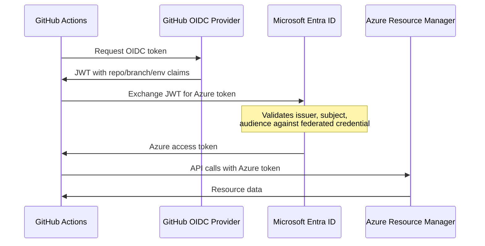

The product's `npm run setup` configures an automation identity and GitHub
repository settings. It is not required to read documentation or draft requirements.
It is also not a read-only environment check.

:::caution[Review access and repository changes first]
The wizard can create an Entra application, service principal, federated
credentials, role assignments, GitHub secrets, variables, and environments.
It also attempts to enable Pages and repository auto-merge. Review
`tools/scripts/setup-azure.sh` in your checkout and obtain authorization for those
changes before running it. Do not run it from apex-docs to configure this site.
:::

## Quick start

From inside the dev container:

```bash
npm run setup
```

The wizard prompts for Azure and repository configuration, then performs its
setup phases. It tracks completion in local state. Re-running it is not proof
that remote resources still match that state.

:::tip[Already have an Entra app?]
The wizard looks up existing applications by display name. Verify the intended
application ID and ownership first. A matching display name is not a unique
identity or permission to reuse the application.
:::

## Prerequisites

| Requirement                                  | How to Check                       |
| -------------------------------------------- | ---------------------------------- |
| Azure CLI logged in                          | `az account show`                  |
| GitHub CLI authenticated                     | `gh auth status`                   |
| jq installed                                 | `jq --version`                     |
| Permission to create Entra app registrations | Ask your Microsoft Entra ID admin  |
| Permission to assign RBAC roles              | Owner or User Access Administrator |

## What gets created

The wizard creates or reuses these resources and settings. Some repository-setting
failures are warnings, so inspect the results rather than assuming every row succeeded.

### Azure resources

| Resource                                   | Details                                            |
| ------------------------------------------ | -------------------------------------------------- |
| Entra ID App Registration                  | `apex-github-oidc-{repo-name}`                     |
| Service Principal                          | Linked to the app registration                     |
| Federated Credential: `github-main`        | Subject: `repo:{owner}/{repo}:ref:refs/heads/main` |
| Federated Credential: `github-env-dev`     | Subject: `repo:{owner}/{repo}:environment:dev`     |
| Federated Credential: `github-env-staging` | Subject: `repo:{owner}/{repo}:environment:staging` |
| Federated Credential: `github-env-prod`    | Subject: `repo:{owner}/{repo}:environment:prod`    |
| RBAC: Reader                               | At Management Group scope (governance reads)       |
| RBAC: Contributor                          | At Subscription scope (deployments)                |

### GitHub resources

| Resource                                 | Details                          |
| ---------------------------------------- | -------------------------------- |
| Secret: `AZURE_CLIENT_ID`                | Entra app client ID              |
| Secret: `AZURE_TENANT_ID`                | Microsoft Entra tenant ID        |
| Secret: `AZURE_SUBSCRIPTION_ID`          | Target subscription ID           |
| Variable: `GOVERNANCE_BASELINE_ENABLED`  | `true` (kill switch)             |
| Variable: `GOVERNANCE_MG_ID`             | Management Group to scan         |
| Variable: `GOVERNANCE_MAX_SUBSCRIPTIONS` | Max subscriptions (default: 100) |
| Environment: `dev`                       | For development deployments      |
| Environment: `staging`                   | For staging deployments          |
| Environment: `prod`                      | For production deployments       |
| GitHub Pages                             | Enabled with Actions source      |
| Auto-merge                               | Enabled on repository            |

## Architecture

GitHub Actions workflows authenticate to Azure using **OpenID Connect
(OIDC)** rather than a long-lived client secret.



The federated credential binds a repository branch or environment identity to
the service principal without a long-lived client secret. Azure role assignments
still determine what that principal can access.

## Headless mode

For CI automation or scripted provisioning, pass `--non-interactive` and
set environment variables:

```bash
export AZURE_TENANT_ID="00000000-0000-0000-0000-000000000000"
export AZURE_SUBSCRIPTION_ID="00000000-0000-0000-0000-000000000000"
export GOVERNANCE_MG_ID="mg-contoso-root"
export GOVERNANCE_MAX_SUBSCRIPTIONS="100"
export APP_DISPLAY_NAME="apex-github-oidc-my-project"
export DEPLOY_ENVIRONMENTS="dev,staging,prod"

npm run setup -- --non-interactive
```

Some values have defaults or come from the current Azure context. Set them
explicitly for a reviewed headless run. The script's `--help` output documents
defaults. Missing required values or invalid IDs stop setup.

## Manual setup

If you cannot run the wizard (for example, a different admin must create
the Entra app), follow these steps manually.

### 1. Create app registration

```bash
# Create the app
az ad app create --display-name "apex-github-oidc-my-project"

# Note the appId from the output, then create the service principal
az ad sp create --id <APP_ID>
```

### 2. Add federated credentials

```bash
APP_ID="<your-app-id>"
REPO="owner/repo"

# Main branch (for scheduled workflows like governance baseline)
az ad app federated-credential create --id "$APP_ID" --parameters '{
  "name": "github-main",
  "issuer": "https://token.actions.githubusercontent.com",
  "subject": "repo:'"$REPO"':ref:refs/heads/main",
  "audiences": ["api://AzureADTokenExchange"]
}'

# Repeat for each environment (dev, staging, prod)
for ENV in dev staging prod; do
  az ad app federated-credential create --id "$APP_ID" --parameters '{
    "name": "github-env-'"$ENV"'",
    "issuer": "https://token.actions.githubusercontent.com",
    "subject": "repo:'"$REPO"':environment:'"$ENV"'",
    "audiences": ["api://AzureADTokenExchange"]
  }'
done
```

### 3. Assign RBAC roles

```bash
SP_OBJECT_ID=$(az ad sp show --id "$APP_ID" --query id -o tsv)

# Reader at Management Group (for governance policy reads)
az role assignment create \
  --assignee-object-id "$SP_OBJECT_ID" \
  --assignee-principal-type ServicePrincipal \
  --role "Reader" \
  --scope "/providers/Microsoft.Management/managementGroups/<MG_ID>"

# Contributor at Subscription (for deployments)
az role assignment create \
  --assignee-object-id "$SP_OBJECT_ID" \
  --assignee-principal-type ServicePrincipal \
  --role "Contributor" \
  --scope "/subscriptions/<SUBSCRIPTION_ID>"
```

### 4. Configure GitHub repository

```bash
# Secrets
gh secret set AZURE_CLIENT_ID --body "$APP_ID"
gh secret set AZURE_TENANT_ID --body "<TENANT_ID>"
gh secret set AZURE_SUBSCRIPTION_ID --body "<SUBSCRIPTION_ID>"

# Variables
gh variable set GOVERNANCE_BASELINE_ENABLED --body "true"
gh variable set GOVERNANCE_MG_ID --body "<MG_ID>"
gh variable set GOVERNANCE_MAX_SUBSCRIPTIONS --body "100"

# Environments
for ENV in dev staging prod; do
  gh api "repos/<OWNER>/<REPO>/environments/$ENV" --method PUT
done
```

## Troubleshooting

### "Not logged in to Azure CLI"

Run `az login --use-device-code` inside the dev container.

### "Cannot list management groups"

Ask your Azure administrator for the read permissions required at the target
management-group scope. Do not request tenant-root access when a narrower
assignment is sufficient.

### "Could not create environment"

GitHub environment creation requires **admin** access to the repository.
If you are a collaborator, ask the repo owner to create the environments
or run the wizard from their account.

### "Federated credential subject mismatch"

The scheduled governance workflow runs on `main` with no environment
context. Its OIDC subject is `repo:{owner}/{repo}:ref:refs/heads/main`.
If you see authentication failures, verify this exact subject exists on
the federated credential.

### Re-running the wizard

State files in `.azure/.setup-state/` track completed phases. Inspect remote
results before retrying. The following resets local setup tracking, not Azure
resources or GitHub settings:

```bash
npm run setup -- --reset
npm run setup
```

## Cleanup

Inventory exact application and service-principal IDs, role-assignment IDs,
federated credentials, and repository changes. Distinguish resources created by
this run from reused resources with other consumers.

Obtain approval for the specific removals. Do not select an application for
deletion by display name or delete a shared principal. Cleanup also needs an
explicit decision about environments, Pages, and auto-merge settings. Removing
three secrets and variables does not undo the full setup.
