```mermaid
flowchart LR
  classDef step fill:#0078d4,stroke:#0078d4,color:#fff,rx:6,ry:6
  classDef gate fill:#fef3c7,stroke:#d97706,color:#7c2d12,rx:6,ry:6
  classDef opt  fill:#1e3a5f,stroke:#0078d4,color:#dbeafe,rx:6,ry:6,stroke-dasharray:4 3

  S1[Step 1<br/>Requirements]:::step --> S2[Step 2<br/>Architecture]:::step
  S2 --> S3[Step 3<br/>Design]:::opt
  S3 --> G35{{Step 3.5<br/>Governance gate}}:::gate
  S2 --> G35
  G35 --> S4[Step 4<br/>IaC Plan]:::step
  S4 --> G4{{Plan approval}}:::gate
  G4 --> S5[Step 5<br/>IaC Code]:::step
  S5 --> G5{{Preview and<br/>apply approval}}:::gate
  G5 --> S6[Step 6<br/>Deploy]:::step
  S6 --> G6{{Verify resources}}:::gate
  G6 --> S7[Step 7<br/>As-Built]:::step
```

import { CardGrid, LinkCard } from "@astrojs/starlight/components";
import AgentChat from "../../components/AgentChat.astro";

<section class="landing-hero not-content">
  

    
APEX

    <h1 class="landing-hero__title">
      Agentic Platform Engineering for Azure
    </h1>
    
Use GitHub Copilot agents to capture requirements, assess costs and policy, and generate Bicep or Terraform. Review the evidence and approve each handoff before deployment.

    

      <a class="sl-link-button primary not-content" href="getting-started/quickstart/">
        Get started
      </a>
      <a class="sl-link-button minimal not-content" href="https://github.com/jonathan-vella/apex-accelerator">
        Use the template
      </a>
    

  

  

    

      <AgentChat />
    

  

</section>

<section class="landing-section scenario-frame not-content">
  

    
How it works

    <h2>Review the plan before deploying</h2>
    
Each main agent owns a step. You select the agent and approve the next action.

  

  

    

      

        
The workflow

        
Start with requirements and architecture, then discover governance
        constraints and approve an implementation plan. Generate and validate
        the code before authorizing deployment. Record the observed result in
        as-built documentation.

      

      

        
What you get

        <ul class="scenario-checklist">
          <li>Bicep or Terraform code based on an approved implementation plan.</li>
          <li>Architecture decisions, cost estimates, and discovered policy constraints.</li>
          <li>Validation results and the reviews required by each step's contract.</li>
          <li>As-built records that distinguish provisioning, health checks, and unresolved issues.</li>
        </ul>
      

    

    

    

  

</section>

<section class="landing-section scenario-frame explore-section not-content">
  

    
Explore

    <h2>Choose a starting point</h2>
  

  

    <CardGrid>
      <LinkCard
        title="April 2026 case study"
        description="Read the catering workload's historical outputs, including its deployment limitations."
        href="demo/"
      />
      <LinkCard
        title="Get started"
        description="Set up from the Accelerator template and run your first agent workflow."
        href="getting-started/quickstart/"
      />
      <LinkCard
        title="How it works"
        description="Understand agent ownership, skills, and human handoffs."
        href="concepts/how-it-works/"
      />
      <LinkCard
        title="Prompt guide"
        description="Scoped examples for main agents and supported skill invocations."
        href="guides/prompt-guide/"
      />
      <LinkCard
        title="Troubleshooting"
        description="Common issues, diagnostic decision tree, and solutions."
        href="guides/troubleshooting/"
      />
    </CardGrid>
  

</section>
