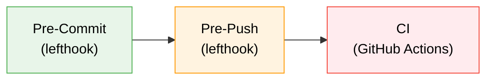

This page describes selected commands from the pinned APEX product. Run them in
that checkout, not apex-docs. The current `package.json`, hook configuration,
and CI files determine exact coverage.

For this documentation site, use `npm run build`, `npm run check:links`,
`npm test`, and `npm run test:browser`. The build uses the Linux toolchain and
prepared pinned product metadata. The link checker validates routes and fragments.
Use `npm run check:external-links` separately for external destinations.

:::tip[Quick reference]

- Pre-commit runs the fastest, file-scoped checks (`markdown-lint`,
  `agents`, `iac-security-baseline`, …).
- `npm run validate:all` is the product's broad local validation entry
  point.
- CI uses its configured suites and path filters. A passed local hook does not
  establish that all CI or runtime checks passed.
- All hooks are defined in [`lefthook.yml`](https://github.com/jonathan-vella/apex/blob/main/lefthook.yml).

:::

**Jump to:** [Architecture](#validation-architecture) ·
[Lefthook Hooks](#lefthook-hooks) ·
[Validation Scripts](#validation-scripts) ·
[CI Workflows](#ci-workflows) ·
[Running Locally](#running-validations-locally)

## Validation architecture

### Stabilization checks

CodeGen proceeds in dependency-ordered batches of up to three new source files, with focused validation after
each edit and a root check at each batch boundary. Routine next-file permission is not required. Explicit user
stop requests, unresolved errors, ownership changes and human approval gates still stop progression.

Use these read-only commands from the repository root:

```bash
node tools/scripts/resolve-deployment-inputs.mjs --input approved-discovery-snapshot.json
node tools/scripts/validate-iac-handoff.mjs --tree-hash infra/bicep/example
node tools/scripts/summarize-deployment-preview.mjs --input preview.json --tool bicep --expected-ids expected.json
node tools/scripts/validate-policy-precheck.mjs precheck.json --preview preview.json --expected-ids expected.json
node tools/scripts/validate-provider-payload.mjs --input resolved-resources.json --s2-max-bytes 268435456000
```

The input resolver consumes approved values and read-only discovery snapshots; it performs no Azure calls or
identity mutations. Its default report omits resolved values. See the [input snapshot contract][input-snapshot].
An unset environment variable is not a reason to ask again for an already approved value.

Capture Bicep what-if with `--no-pretty-print --output json`. The summarizer returns exit 0 for checked evidence,
2 for required review and 1 for invalid or blocked evidence. Expected IDs come from approved resource bindings,
including child resources, not from copying the observed result. A passing preview never grants apply permission.

For unexpected Bicep `Ignore` records only, both preview commands support `--ignored-evidence bundle/ignored.json`.
The [ignored-resource evidence contract][ignored-evidence] binds exact preview/expected-ID hashes to saved
parent/child observations. It supports private-endpoint NICs, SQL `master` and Storage-linked system topics,
with exact IDs and reasons, not wildcard exclusions. The records remain visible in the summary. Changed actions,
missing managed resources and unknown coverage still block; relationship evidence does not confer apply approval.

Provider-payload checks cover known SQL S2 and App Service Plan regressions only. Supply a concrete resource array
extracted from generated payloads with recorded provenance; unresolved expressions remain unverified. The example
SQL byte size must be checked against the target region's capabilities and approved configuration before use.
Compilation, provider validation, preview and successful deployment are distinct outcomes.

[input-snapshot]: https://github.com/jonathan-vella/apex/blob/main/.github/skills/apex-azure-defaults/references/identity-resolution.md#resolve-before-asking
[ignored-evidence]: https://github.com/jonathan-vella/apex/blob/main/.github/skills/apex-iac-common/references/deploy-shared-workflow.md#accounted-ignored-resources

Validation runs at three stages, catching issues progressively earlier:



1. Pre-commit runs configured checks. Publication Markdown/artifact checks use the staged index.
2. Pre-push selects domain checks for changed files.
3. CI runs the suites and filters declared by the current workflow.

## Lefthook hooks

All hooks are defined in `lefthook.yml` at the repository root.

### Pre-commit hooks

Markdown and artifact checks run through `node tools/scripts/check-publication-scope.mjs markdown|artifacts`.
They materialize an isolated index snapshot, so partially staged files are checked as committed. Unrelated untracked
projects cannot block publication. Template, artifact-guidance and validator changes still run H2/template and review
presence checks across all tracked artifacts in that snapshot. Markdown uses the installed local executable; failures
propagate without filtering away exit codes. These checks never format, stage or rewrite project files.

| Hook                    | Trigger (glob)                                      | Purpose                                               |
| ----------------------- | --------------------------------------------------- | ----------------------------------------------------- |
| `markdown-lint`         | `*.md`                                              | markdownlint on staged markdown files                 |
| `artifact-validation`   | Staged artifacts, templates, guidance and validators | H2/template and review presence checks on tracked snapshot |
| `agents`                | `**/*.agent.md`, `**/*.prompt.md`                   | Agent frontmatter, model alignment, body size         |
| `instructions`          | `**/*.instructions.md`, agents, skills              | Instruction frontmatter and cross-reference validity  |
| `secrets-baseline`      | _(all staged files)_                                | gitleaks secret scan (soft-skip if not installed)     |
| `python-lint`           | `tools/mcp-servers/**/*.py`                         | Ruff linter on Python files                           |
| `terraform-fmt`         | `*.tf`                                              | Terraform formatting check                            |
| `terraform-validate`    | `*.tf`                                              | Terraform validation per project                      |
| `iac-security-baseline` | `infra/bicep/**/*.bicep`, `infra/terraform/**/*.tf` | TLS 1.2, HTTPS-only, no public blob, managed identity |

### Commit-msg hook

| Hook         | Purpose                                                                     |
| ------------ | --------------------------------------------------------------------------- |
| `commitlint` | Enforce [Conventional Commits](https://www.conventionalcommits.org/) format |

### Pre-push hooks

| Hook               | Purpose                                             |
| ------------------ | --------------------------------------------------- |
| `branch-naming`    | Validate branch name uses an approved prefix        |
| `branch-scope`     | Validate domain branches only modify in-scope files |
| `diff-based-check` | Run domain-scoped validators for changed file types |

## Validation scripts

All scripts are in the `tools/scripts/` directory. Run via `npm run <command>`.

### Architecture and registry validators

| npm Command                   | Script                            | Purpose                                        |
| ----------------------------- | --------------------------------- | ---------------------------------------------- |
| `validate:agents`             | `validate-agents.mjs`             | Agent frontmatter, body size, model alignment  |
| `validate:skills`             | `validate-skills.mjs`             | Skill format, affinity, references, stale refs |
| `validate:skill-checks`       | `validate-skill-checks.mjs`       | Skill size (≤500 lines) and references         |
| `validate:instruction-checks` | `validate-instruction-checks.mjs` | Instruction frontmatter and applyTo patterns   |
| `validate:agent-registry`     | `validate-agent-registry.mjs`     | Agent registry consistency                     |
| `validate:workflow-graph`     | `validate-workflow-graph.mjs`     | DAG integrity (no orphans, no cycles)          |

### Artifact and template validators

| npm Command          | Script                   | Purpose                                                   |
| -------------------- | ------------------------ | --------------------------------------------------------- |
| `validate:artifacts` | `validate-artifacts.mjs` | H2 sync, template compliance, and auto-fix (with `--fix`) |

### Governance and compliance validators

| npm Command                      | Script                               | Purpose                                                      |
| -------------------------------- | ------------------------------------ | ------------------------------------------------------------ |
| `lint:governance-refs`           | `validate-governance-refs.mjs`       | Governance guardrails integrity                              |
| `validate:no-hardcoded-counts`   | `validate-no-hardcoded-counts.mjs`   | Prevent hardcoded entity counts                              |
| `lint:deprecated-refs`           | `validate-no-deprecated-refs.mjs`    | Block deprecated API/pattern references                      |
| `validate:iac-security-baseline` | `validate-iac-security-baseline.mjs` | IaC security baseline (TLS, HTTPS, blob, identity, SQL auth) |

### Session and state validators

| npm Command              | Script                       | Purpose                                                   |
| ------------------------ | ---------------------------- | --------------------------------------------------------- |
| `validate:session-state` | `validate-session-state.mjs` | Schema validation + deprecated lock/claim field detection |

### Quality and cross-reference validators

| npm Command             | Script                          | Purpose                            |
| ----------------------- | ------------------------------- | ---------------------------------- |
| `lint:glob-audit`       | `validate-glob-audit.mjs`       | Detect overly broad glob patterns  |
| `lint:orphaned-content` | `validate-orphaned-content.mjs` | Detect unreferenced skills/content |
| `lint:docs-freshness`   | `check-docs-freshness.mjs`      | Documentation staleness detection  |
| `validate:retirement-scan` | `audit-retirement-candidates.mjs` | Tracked-file census and schema checks |
| `lint:version-sync`     | `validate-version-sync.mjs`     | Version consistency across files   |

### Configuration validators

| npm Command       | Script                       | Purpose                           |
| ----------------- | ---------------------------- | --------------------------------- |
| `validate:vscode` | `validate-vscode-config.mjs` | VS Code settings completeness     |
| `validate:hooks`  | `validate-hooks.mjs`         | Hook script structure and syntax  |
| `test:hooks`      | `test-hooks.sh`              | Hook integration tests (bats)     |
| `lint:mcp-config` | `validate-mcp-config.mjs`    | MCP server configuration validity |

### Code and format linters

| npm Command          | Tool                | Purpose                                                  |
| -------------------- | ------------------- | -------------------------------------------------------- |
| `lint:md`            | markdownlint-cli2   | Markdown formatting and style                            |
| `format:check`       | Prettier            | Code formatting (JS/JSON/CSS; markdown via markdownlint) |
| `lint:links`         | `check-repository-links.mjs` | Product repository link checks                     |
| `lint:json`          | `lint-json.mjs`     | JSON/JSONC syntax validation                             |
| `lint:python`        | ruff                | Python code quality (`tools/apex-recall/`)               |
| `lint:terraform-fmt` | terraform fmt       | Terraform formatting compliance                          |
| `lint:bicep-fmt`     | bicep format        | Bicep formatting compliance (no-op when no projects)     |
| `validate:terraform` | terraform validate  | Terraform validation per project                         |

### Aggregate commands

| npm Command          | Purpose                                       |
| -------------------- | --------------------------------------------- |
| `validate:all`       | Run cache-aware Node validators plus external validators |
| `validate:_node`     | Node validators in one cache-sharing process; bounded children for Python, ESLint, and tests |
| `validate:_external` | All external tool validators in parallel      |
| `validate:agents`    | Agent frontmatter, body, model alignment      |
| `validate:artifacts` | H2 sync, template compliance, auto-fix        |
| `validate:skills`    | Skill format, affinity, references, stale     |
| `audit:quarterly`    | Quarterly context audit checks                |
| `audit:retirement`   | Generate or inspect the whole-repository retirement census |

> `validate:_external` is a **local-developer** aggregate (run all external-tool
> linters in one shot). In CI its members are gated individually so coverage does
> not depend on the aggregate: `lint:md` and `format:check` run in `ci.yml`,
> `lint:python` runs in the `ci.yml` external-tests job. Inspect current workflow
> steps for the remaining external checks; do not assume a retired `iac-checks.yml`
> still runs them. Site checks belong to the separate apex-docs repository.

`validate:_node:legacy` and `validate:_node-ci:legacy` retain the former
unbounded `run-p` aggregates as rollback and benchmark baselines.

### Agent-invoked IaC validators (runtime, not CI)

These validators are run **by agents during the workflow** against generated
artifacts (Steps 4–6), not by lefthook or CI. They have no committed inputs on
`main`, so they are intentionally absent from the aggregates above.

| npm Command                          | Invoked by                          | Validates                          |
| ------------------------------------ | ----------------------------------- | ---------------------------------- |
| `validate:iac-contract`              | 05-IaC Planner                      | `04-iac-contract.json` schema/DAG  |
| `validate:iac-contract-consistency`  | 05-IaC Planner                      | Contract ↔ implementation plan     |
| `validate:iac-handoff`               | 06b/06t CodeGen                     | `05-iac-handoff.json` + tree hash  |
| `validate:environment-manifest`      | 05-IaC Planner                      | `04-environment-manifest.json`     |
| `validate:policy-property-map`       | 05-IaC Planner                      | `04-policy-property-map.json`      |

## CI workflows

All workflows are in `.github/workflows/`.

| Workflow                  | File                            | Trigger                      | Purpose                                                                                            |
| ------------------------- | ------------------------------- | ---------------------------- | -------------------------------------------------------------------------------------------------- |
| CI                     | `ci.yml`                        | PR to `main`, push to `main` | Full validation suite (markdown, Prettier, agents, skills, hooks, bats tests, MCP, VS Code config) + Python ruff in the external-tests job |
| Branch Enforcement        | `branch-enforcement.yml`        | PR to `main`                 | Branch naming convention and scope validation                                                      |
| Consumer Template Checks | `consumer-template-checks.yml` | Configured template checks | Validate consumer-template behavior |
| Dev Container Base Validation | `validate-devcontainer-base.yml` | Relevant PR changes or manual dispatch | Compare candidate container bases on native architectures |
| Upstream Skill Drift | `upstream-skill-drift.yml` | Weekly (Monday 06:00 UTC) or manual dispatch | Compare the reviewed `microsoft/azure-skills` tag with the latest release (`npm run report:upstream-skills`) and keep one labelled issue up to date; never edits skills |

The apex-docs repository owns the site's build and publishing workflows.
Product validation does not publish documentation.

## Running validations locally

```bash
# Run everything
npm run validate:all

# Run a specific category
npm run lint:md                    # Markdown only
npm run validate:agents            # Agent definitions only
npm run validate:session-state     # Session state only

# Auto-fix where supported
npm run lint:md:fix                # Fix markdown issues
npm run fix:artifacts -- <file> --apply  # Fix artifact H2 headings
npm run lint:python:fix            # Fix Python lint issues
```

---

:::tip[Further Reading]

- [Contributing](../../project/contributing/). branch naming and commit conventions
- [Agent Hooks](../../guides/hooks/). VS Code agent hooks (lifecycle automation)
- [Workflow Validation](../../guides/e2e-testing/). focused checks and manual acceptance

  :::
